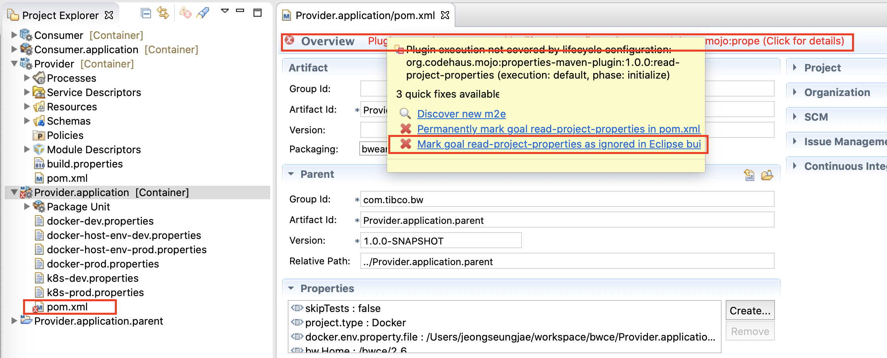

# BWCE Maven Plugin 구성

[toc]

## 0. 환경 이해
해당 챕터는 앞서 [BWCE Applicatoin 실행 on Kubernetes](https://tibco-korea.github.io/BWCE/4.BWCE_App_onKubernetes.html)의 이해를 바탕으로 한 Maven확장입니다.
provider, consumer 샘플 어플리케이션을 Maven으로 빌드하여 Kubernetes에 배포되어 있는 Application Monitoring과 연계 합니다.


## 1. BWCE Maven Plugin 설치

### 1.1 Maven 설치

BusinessWorks Studio에 내장되어 있는 Maven 은 BWCE Maven Plugin을 사용하기에 낮은 버전으로 지원이 안됩니다.
최신 Maven (버전 3.6.3) 을 설치합니다.  
[https://maven.apache.org/download.cgi](https://maven.apache.org/download.cgi) 에서 apache-maven-3.6.3-bin.zip을 다운로드 합니다.

```bash
$ unzip apache-maven-3.6.3-bin.zip
$ cd apache-maven-3.6.3
$ ls 
LICENSE    NOTICE     README.txt bin        boot       conf       lib
```

환경변수 `MAVEN_HOME` 및 `PATH`를 설정합니다.
- Linux 계열
```bash
export MAVEN_HOME={압축푼경로}/apache-maven-3.6.3
export PATH=$MAVEN_HOME/bin:$PATH
```
-Windowns 계열
`Windows 설정 - 시스템 - 정보 - 시스템 정보 - 고급 시스템 설정 - 환경 변수` 에서 `MAVEN_HOME` 및 `PATH`설정

Maven 설치를 확인합니다.
```bash
$ mvn --version
Apache Maven 3.6.3 (cecedd343002696d0abb50b32b541b8a6ba2883f)
Maven home: /Users/jeongseungjae/maven/apache-maven-3.6.3
Java version: 1.8.0_221, vendor: Oracle Corporation, runtime: /Library/Java/JavaVirtualMachines/jdk1.8.0_221.jdk/Contents/Home/jre
Default locale: ko_KR, platform encoding: US-ASCII
OS name: "mac os x", version: "10.15.3", arch: "x86_64", family: "mac"
```

### 1.2 BWCE Maven Plugin 설치

BW6와 BWCE는 동일 Maven Plugin을 사용합니다. 해당 Maven Plugin 에 대한 Github 주소는 [https://github.com/TIBCOSoftware/bw6-plugin-maven](https://github.com/TIBCOSoftware/bw6-plugin-maven)이며 본 블로그 내용 이외의 상세 내용은 해당 github 주소를 참조하시기 바랍니다.

#### 1.2.1 BWCE Maven Plugin 다운

다운로드에 앞서 보유하고 있는 BW6(BWCE포함)의 버전과 호환되는 Maven Plugin의 버전을 확인합니다.
[https://github.com/TIBCOSoftware/bw6-plugin-maven/wiki/BW-Release-Compatibility-Guide](https://github.com/TIBCOSoftware/bw6-plugin-maven/wiki/BW-Release-Compatibility-Guide)


BW6.7 , BWCE 2.6.0 , BWCE 2.6.1 사용자는 Maven Plugin v 2.8.0을 다운로드 합니다.
다운로드 : [https://github.com/TIBCOSoftware/bw6-plugin-maven/releases/download/v2.8.0/TIB_BW_Maven_Plugin_2.8.0.zip](https://github.com/TIBCOSoftware/bw6-plugin-maven/releases/download/v2.8.0/TIB_BW_Maven_Plugin_2.8.0.zip)

다른 기타 Release 버전은 [https://github.com/TIBCOSoftware/bw6-plugin-maven/releases/](https://github.com/TIBCOSoftware/bw6-plugin-maven/releases/)에서 확인 하시기 바랍니다.

#### 1.2.2 BWCE Maven Plugin 설치
```bash
$ unzip TIB_BW_Maven_Plugin_2.8.0.zip
```

`install.sh {BW홈/BWCE홈}`(Linux 계열) 혹은 `install.bat {BW홈/BWCE홈}`(윈도우 계열) 실행하여 Plugin을 설치합니다.
해당 작업은 1~3분 정도 소요될수 있습니다.
```bash
$ chmod 755 install.sh
$ ./install.sh /Users/jeongseungjae/tibco/bw70

최종 결과화면
setup:

BUILD SUCCESSFUL
Total time: 1 minute 44 seconds
```

#### 1.2.3 BusinessWorks Studio의 Maven 버전 설정 변경

BusinessWorks Studio의 환경설정 -> Maven -> Installations 에서 Maven최신 버전 (3.6.3) 을 기본 Maven 으로 설정합니다.


기본 Maven을 외부 Maven으로 변경합니다.


## 2. Provider Application을 Maven Project로 변경

### 2.1. Provider Application용 Maven POM 파일 생성

Application -> Generate POM for Application을 선택하여 POM.xml 파일 생성


### 2.2. Deploy 옵션 선택

Deploy Option을 Docker 로 선택


### 2.3. Docker 환경 정보 입력

Docker Host(Docker Image가 Build 되는 Host) 
> Linux 계열 (`unix:///var/run/docker.sock`) , Windows 계열 (`tcp://0.0.0.0:2375`)
> Windowns 계열의 경우 Docker Host 데몬 Port를 활성화 해주어야 합니다.
> 

Image Name : <저장소,사용자명>/<이미지이름>:<태그> 명명 규칙 
BWCE Image : 앞서 Build 되어 있는 BWCE 엔진이 탑재된 Base Image 이름


### 2.4. Kubernetes 환경 정보 입력

앞서  [BWCE Applicatoin 실행 on Kubernetes](https://tibco-korea.github.io/BWCE/4.BWCE_App_onKubernetes.html) 에서 메뉴얼 하게 작성하였던 Deployment 와 Service Resource에 대한 정보를 입력합니다.

Pod에 전달할 환경 변수를 입력하고, Monitoring을 위해 `BW_APP_MONITORING_CONFIG` 변수에 기존 Monitoring의 Service Resource 정보를 전달합니다.
>BW_APP_MONITORING_CONFIG : {"url":"http://bwce-mon-svc:8080"}
>PROVIDER_PORT : 8000
>BW_PROFILE : Docker


### 2.5. Provider.application.parent 및 pom.xml 생성 확인

정상적으로 pom.xml 생성을 마쳤을 경우, 아래 그림처럼 각 모듈에 pom.xml 파일과 application.parent 모듈이 생성된 것을 확인 할 수 있습니다.


### 2.6. pom.xml 에러 없애기
lifecycle configuration: org.codehaus.mojo:properties-maven-plugin:1.0.0:read-project-properties 에러 없애기

Eclipse에서 특정 Maven Plugin의 Goal이 Maven Lifecyle과 맵핑정보가 없을때 에러를 표시합니다. 실행에는 문제가 없으나, 에러 표시가 거슬린다면, 해당 에러를 무시(ignored) 하여 제거 하실수 있습니다.




## 3. Maven Build 하기

application.parent 모듈의 pom.xml에서 Run As -> Maven Build 를 선택하여 Maven Build를 실행합니다.


BWCE Maven Plugin의 상세 Goal은 [https://github.com/TIBCOSoftware/bw6-plugin-maven/wiki/Building-applications-for-TIBCO-BusinessWorks-Container-Edition-in-Docker-and-Kubernetes-or--Openshift](https://github.com/TIBCOSoftware/bw6-plugin-maven/wiki/Building-applications-for-TIBCO-BusinessWorks-Container-Edition-in-Docker-and-Kubernetes-or--Openshift) 을 참조하시기 바랍니다.

### 3.1. EAR Package 생성하기

Maven Goal : clean package 실행


결과 확인


### 3.2. Provider Docker Image 생성

Maven Goal : clean package initialize docker:build 실행


결과 확인


### 3.3. Docker Registry에 Provider Docker Image Push 하기

생성된 Docker Image를 Docker Registry에 Push하기 위해서는 Docker Login 단계가 필요합니다.

- `docker login` 명령어를 통한 Login 
```bash
$ docker login -u <사용자 ID> -p <패스워드>
WARNING! Using --password via the CLI is insecure. Use --password-stdin.
Login Succeeded
$ cd ~/workspace/bwce/Provider.application.parent
$ mvn initialize docker:push
```

또는

- Maven의 settings.xml에 인증 정보 입력
~/.m2/settings.xml 파일 생성 후 아래 인증 정보 입력
```
<settings xmlns="http://maven.apache.org/SETTINGS/1.0.0" xmlns:xsi="http://www.w3.org/2001/XMLSchema-instance"
  xsi:schemaLocation="http://maven.apache.org/SETTINGS/1.0.0 https://maven.apache.org/xsd/settings-1.0.0.xsd">
  <servers>
    <server>
      <id>docker.io</id>
      <username>사용자ID</username>
      <password>패스워드</password>
    </server>
  </servers>
</settings>
```

Maven Goal : initialize docker:push 실행


결과 확인


### 3.4. Kubernetes Resource 파일(yaml) 생성

Maven Goal : initialize com.tibco.plugins:bw6-maven-plugin:bwfabric8json fabric8:resource  실행


결과 확인


### 3.5. Kubernetes Resource 적용 및 배포

Maven Goal : initialize fabric8:apply  실행


결과 확인


배포 확인
```bash
$ kubectl get service -o wide
NAME                    TYPE        CLUSTER-IP       EXTERNAL-IP   PORT(S)          AGE   SELECTOR
bwce-mon-svc            NodePort    10.99.135.150    <none>        8080:30080/TCP   13d   app=bwce-mon
kubernetes              ClusterIP   10.96.0.1        <none>        443/TCP          59d   <none>
postgres-bwce-mon-svc   NodePort    10.99.130.39     <none>        5432:30432/TCP   16d   app=postgres-bwce-mon
provider-svc            NodePort    10.103.227.233   <none>        80:30229/TCP     25s   app=Provider.application,container=provider,group=com.tibco.bw,project=provider,provider=fabric8
```
> provider-svc의 Service Resource 가 NodePort 30229(랜덤)으로 배포된 것을 확인 할수 있습니다.


### 3.6. EAR 패키지 부터 Kubernetes까지 OneStep 배포

앞서 개별 Maven Phase 및 Goal 을 하나로 엮어서 실행 가능합니다.

clean com.tibco.plugins:bw6-maven-plugin:bwdesignUtility package docker:build docker:push com.tibco.plugins:bw6-maven-plugin:bwfabric8json fabric8:resource fabric8:apply

그중 `com.tibco.plugins:bw6-maven-plugin:bwdesignUtility`은 BW Application의 validation작업과 Process 다이어그램을 생성해 주는 역활을 합니다. 

```bash
$ cd ~/workspace/bwce/Provider.application.parent
$ mvn clean com.tibco.plugins:bw6-maven-plugin:bwdesignUtility package docker:build docker:push com.tibco.plugins:bw6-maven-plugin:bwfabric8json fabric8:resource fabric8:apply
```
