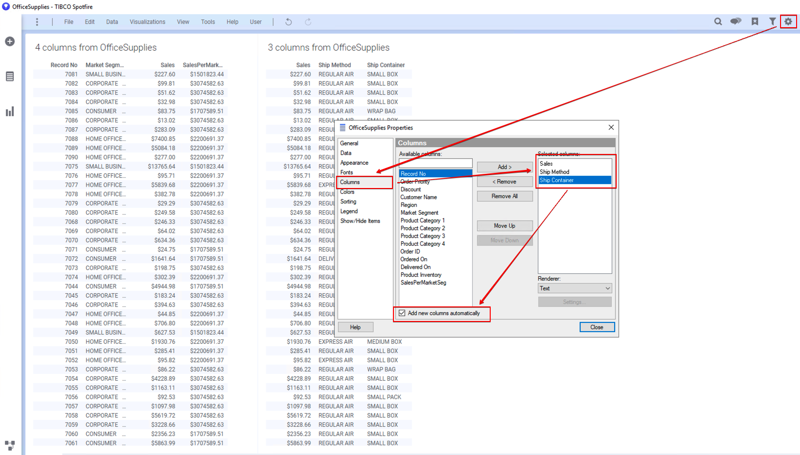
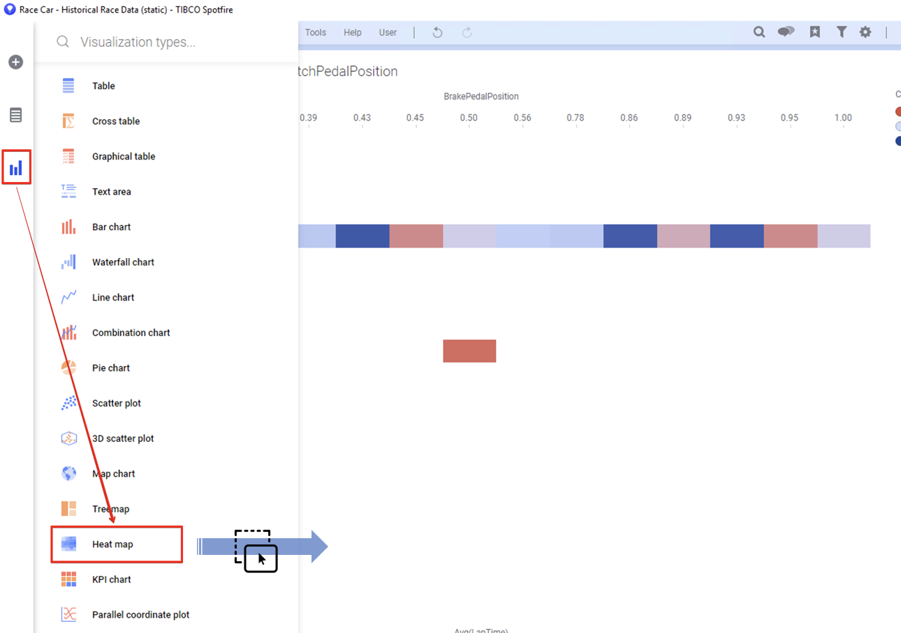
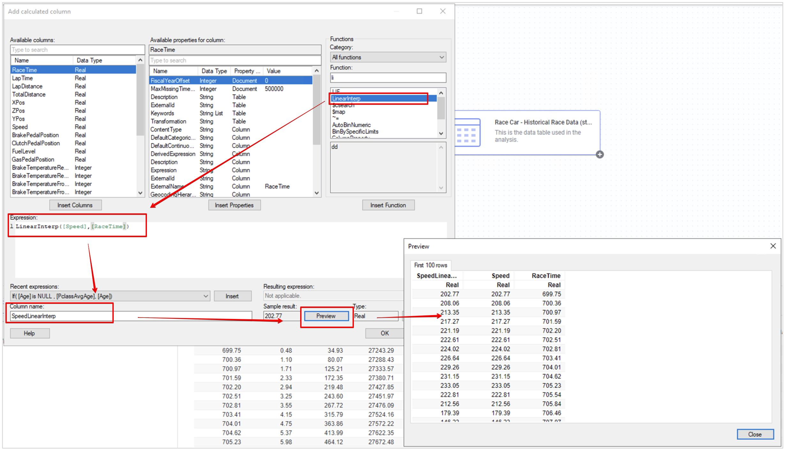
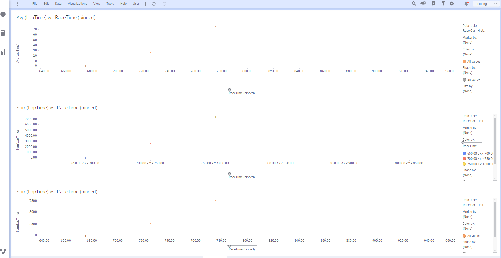

# Spotfire 데이타 랭글링 튜토리얼

## 1. Spotfire 표현식 사용

### 1.1 과정 목표

- Spotfire 표현식을 이해하고 Expression Builder를 사용할수 있도록 합니다.
- 계산된 컬럼을 이해 하고 생성 할 수 있습니다.
- 표현식에 Spotfire 내장함수를 사용 할 수 있습니다.
- 시각화 차트에서 표현식을 사용 할 수 있습니다.

### 1.2 기본 표현식

#### 1.2.1 데이터 로딩

dataSet 폴더에서 **OfficeSupplies.txt** 파일을 로딩 합니다.

<kbd><a href="https://dangtong76.github.io/spotfireBasic/dataSet/dataWrangling_data/OfficeSupplies.txt" download>데이터셋 다운로드 링크 클릭</a></kbd>

#### 1.2.2 계산된 컬럼

왼쪽 시각화 패널에서 **Table** (테이블차트) 를 선택해서 페이지에 옮겨 놓습니다. **Properties** → **Columns** 에서 <kbd> Remove All </kbd> 을 클릭해서 모든 컬럼을 제거 합니다.


모두 제거후에 **Order ID** , **Sales**, **Discount** 3개 컬럼만 추가 하고, 아래 **Add new columns automatically ** 를 체크 합니다. 체크를 하게 되면 이후 만들어진 모든 컬럼이 테이블에 자동으로 업데이트 됩니다. 체크 하지 않으면 컬럼이 추가 될때마다 Properties 에서 추가해줘야 해서 매우 귀찮게 됩니다.


자 이제 할인(discount) 되지 않은 판매가격(Sales) 컬럼을 생성 해 보겠습니다. <kbd> Data </kbd>→<kbd>Add calculated column</kbd> 을 클릭 합니다. Expression Builder 창이 뜨게 되고 아래 내용을 입력합니다.

| 항목        | 입력 값                  |
| ----------- | ------------------------ |
| Column name | NoDisSales               |
| Expression  | [Sales]/( 1-[Discount] ) |


화폐단위 표시를 위해 <kbd>Formatting</kbd>을 클릭 합니다. 아래 화면과 같이 **Currency** 탭에서 **Apply formatting from Column** 항목을 **Sales** 를 선택 한뒤 <kbd>Apply</kbd>→ <kbd>OK</kbd>를 클릭 합니다.


최종적으로 아래 화면과 같이 완성 됩니다.


이제 계산된 컬럼은 시각화에서 바로 추가하는 방법을 살펴 보겠습니다. 일단 왼쪽 시각화 패널에서 **Combination Chart**(복합차트) 를 선택해서 페이지에 그래프를 생성 합니다.

**Y 축에** 에 **NoDisSales** 컬럼을 집계함수 Sum 으로 추가 합니다. 그러면 오른쪽상단에 Series by 에 만들어진 **Sum(NoDisSales)** 클릭해서 **Line Chart** 로 변경해 줍니다.


이렇게 설정 하면 최종 모습은 아래와 같이 됩니다.


이제 배송에 얼마나 걸리는지 계산하기 위해 새로운 컬럼을 생성 하겠습니다. <kbd>Data</kbd>→<kbd>Add calculated column</kbd> 을 클릭 합니다. 함수 검색란 에서 diff 라고 입력 하면 DateDiff 함수가 보입니다. 2개의 날짜 입력값의 차이를 구하는 함수 입니다. 입력 항목은 아래와 같습니다.

| 항목        | 입력값                                           |
| ----------- | ------------------------------------------------ |
| Expression  | DateDiff( 'dd' , [Ordered On] , [Delivered On] ) |
| Column name | DaysToDeliver                                    |

dd 는 하루단위의 날짜로 차이를 구합니다. 외에 wk(week), hh(hour), mm(minute), ss(second), ms(millisecond) 가 있습니다.


모두 입력한 뒤 <kbd>OK </kbd> 를 클릭하면 아래와 같이 DayToDeliver 컬럼이 자동으로 테이블에 추가 됩니다.


Spotfire 하단의 [ + ] 버튼을 클릭해서 새로운 페이지를 만들어 주세요. 시각화 패널에서 **Bar Chart ** 를 선택 해서 생성 합니다.

**Y축**은 **Sales 의 합계**로 설정 하고, **X축**은 **Product Category 1** 로 설정 합니다.

오른쪽 상단의 **Color by** 바로 아래를 클릭하면 표현식을 입력 할수 있는 창이 나타납니다. Expression 란에 **If([DaysToDeliver]>30,"Late","Ontime")** 를 입력합니다. 30일이 지난 것들은 배송이 늦은 것으로 별도 표시 하기 위해서 입니다. 

### 1.3 연습문제

#### 연습문제 1

테이블에 Primary 키를 추가하기 위해 1부터 순차적으로 증가하는 고유 ID 컬럼을 부여 하세요 컬럼의 이름은 **ID** 로 생성 합니다.

#### 연습문제 2

**Order Priority** 컬럼은 숫자와 문자로 결합 되어 있습니다. 향후에 연산을 적용 할 경우 어려움이 예상되어 **Priority Level** 와 **Priority** 로 컬럼을 분리 하세요.

### 1.4 고급 표현식 사용

#### 1.4.1 데이터 로딩

dataSet 폴더에서 **OfficeSupplies.txt** 파일을 로딩 합니다.

<kbd><a href="https://dangtong76.github.io/spotfireBasic/dataSet/dataWrangling_data/OfficeSupplies.txt" download>데이터셋 다운로드 링크 클릭</a></kbd>

#### 1.4.2 OVER 함수를 이용한 컬럼 추가

Spotfire 의 OVER 함수는 고급 표현식에서 가장 많이 사용되는 함수 입니다. DB에서의 GroupBy 문이라고 생각 하면 됩니다. 판매시장(Market Segment) 별 매출액 집계 하겠습니다.

왼쪽 시각화 패널에서 **Table** (테이블 차트) 를 선택해서 생성 합니다. 오른쪽 상단의 **Properties** 아이콘을 클릭한뒤, **Column** 탭에서 **Record No, Market Segment, Sales** 개 컬럼만 선택 하고 하단의 **Add new columns automatically** 를 체크 합니다.


Spotfire 메뉴에서 <kbd>Data</kbd>→<kbd>Add calculated column</kbd>을 클릭해서 Expression Builder 창을 뛰웁니다. 아래 항목을 입력 하세요.

| 항목        | 입력 값                                   |
| ----------- | ----------------------------------------- |
| Expression  | Sum( [Sales] ) OVER ( [Market Segment ] ) |
| Column name | SalesPerMarketSeg                         |


최종 화면은 아래와 같습니다. 집계를 할 경우 동일한 **Market Segment** 는 값이 동일 하다는 점을 명심 하세요


이제 신규 **Table** 을 동일한 페이지의 오른편에 추가해서 운송 수단 및 포장 타입 별 평균 배송 기간을 연산해서 컬럼을 추가 해 보도록 하겠습니다.

왼쪽 시각화 패널에서 **Table** 을 선택해서 기존 페이지의 오른편에 생성 합니다. **Properties**(속성) 에서 **Columns** 탭을 선택하고 **Sales, Ship Method, Ship Container** 를 선택 한뒤, **Add new columns automatically** 를 체크 합니다.



Spotfire 메뉴에서 <kbd>data</kbd>→<kbd>Add calculated column</kbd> 을 클릭해서 Expression Builder 창을 뛰웁니다. 입력 항목은 아래와 같습니다.

| 항목         | 입력값                                                                                |
| ------------ | ------------------------------------------------------------------------------------- |
| Expression   | Avg(DateDiff('dd',[Ordered On],[Delivered On])) OVER ([Ship Container],[Ship Method]) |
| Column names | AvgDaysDeliver                                                                        |


최종 Table의 결과 화면은 아래와 같습니다.


#### 1.4.3 시각화 에서 OVER 함수 사용

Spotfire 화면 하단의 페이지 영역에서 [ + ] 를 클릭해서 신규 페이지를 만듭니다. 해당 페이지에 **Bar Chart** 를 생성 합니다. 차트의 축 설정은 아래와 같습니다.

| 항목 | 설정                                                     |
| ---- | -------------------------------------------------------- |
| X 축 | Ordered On 컬럼을 Year > Quarter > Month 로 설정 합니다. |
| Y 축 | Sum( [Sales] ) / Sum( [Sales]) OVER ALL( [Axis.X] )      |


Y 축을 좀더 깔끔하게 하기 위해 **Properties** 창에서 **Formatting** 탭에 **Y축** 설정을 **Percentage** 를 선택하고 **Decimals 를 1**로 설정 합니다.


**Properties** 창에서 **Labels** 탭에 **Show labels for** 항목을 **ALL** 로 , **Types of labels** 항목을 **체크**, **Label orientation** 을 **Vertical** 로 선택 합니다.


Bar 차트로 돌아오면 X축이 현재 Month 로 선택되어 있습니다. 마우스를 왼쪽으로 드래그 해서 **Year** 로 변경 하면 아래와 같은 화면이 보이게 됩니다.


#### 1.4.4 Previous 사용 및 Expression 색상 적용

이제 Bar 차트를 이용해서 전월매출의 차이를 계산하는 표현식을 작성해 보도록 하겠습니다.

왼쪽 시각화 메뉴에서 현재 페이지에 **Bar Chart** 를 추가 합니다. 축설정은 아래와 같습니다.

| 항목 | 설정                                                                              |
| ---- | --------------------------------------------------------------------------------- |
| X 축 | **Ordered On** 컬럼을 Year > Quater > Month 로 선택                               |
| Y 축 | Sum( [Sales] ) - Sum( [Sales] ) OVER ( Previous( [Axis.X] ) ) as 전월대비매출증감 |

> Axis.X 는 X 축을 의미 합니다. Previous( [Axis.X]) 는 모든 점에서 각각의 전 지점 을 의미 합니다. 이렇게 하게 되면 축이 일, 월, 년 으로 바뀌어도 동일한 계산을 수행 할 수 있기 때문에 굉장히 편리 합니다.


설정 후에는 Bar Chart 가 아래와 같이 보이게 됩니다.


이제 증감을 확실하게 구분 하기 위해 표의 색깔을 수정 해보겠습니다. **Properties** 창으로 이동 합니다. **Colors** 탭에서 **Columns** 항목을 클릭합니다. 팝업창의 **Edit expression** 란에 기존 Y축 설정 Expression 을 복사해서 입력 합니다.


**Colors** 탭의 **Color mode** 를 **Segments** 로 설정 합니다. <kbd> Add Point </kbd> 를 클릭하면 Min 과 Max 사이에 지점이 하나 추가 됩니다. 해당 지점의 값을 $0 을 설정 합니다.


최종적으로 전월, 전분기, 전년 대비 매출 증감을 확인 할수 있는 멋진 차트가 완성 되었습니다. X축의 컬럼을 드래그 해서 분기, 년간 매출 증감을 확인 해보세요


#### 1.4.5 숏컷을 이용한 이동평균선


위의 주식차트 에서 붉은 색과 검은색 그래프가 이동 평균선 그래프 입니다. 이동 평균선을 만들때는 검은색 이동 평균선은 붉은색 이동 평균선에 비해 평균계산시 더 긴 일자를 산정해서 계산 했습니다. 예를 들어 붉은색은 3일 이동 평균선이면 검은색은 1달 이동 평균선 이라고 할 수 있습니다. 이동 평균선은 전체적인 추이를 볼 때 사용 합니다.

Y-축에 이동 평균선을 만드는 방법을 살펴 보도록 하겠습니다. 우리는 8단위(월,년) 이동 평균선을 만들 겁니다. 새로운 페이지를 추가하고 **Line Chart** 를 생성 합니다. 각 축의 설정은 아래과 같습니다.

| 항목 | 설정                                                |
| ---- | --------------------------------------------------- |
| X 축 | **Ordered On** 컬럼을 Year > Quater 로 설정 합니다. |
| Y 축 | **Sum(Sales)**                                      |

Sum([Sales]) THEN Avg([Value]) OVER (LastPeriods(3,[Axis.X])) THEN If(Count() OVER (LastPeriods(3,[Axis.X]))=3,[Value],null)

월 단위의 매출 합계의 추이는 아래와 같습니다.


**Y축** 항목에 컬럼을 아래와 같이 추가 합니다.


최종 결과는 아래와 같습니다.


수식을 직접 작성 하지 않고도 숏컷 메뉴를 통해 손쉽게 이동 평균선을 작성 하였습니다.

#### 1.4.6 제어식 사용하기 (CASE WHEN)

## 2. Pivot 과 UnPivot

스케이트 보드에서 피벗은 판을 뒤집거나 방향을 전환하기 위해 꺽는 것을 의미 합니다. 데이터 처리에서 피벗도 마찬가지로 열로 된 데이터를 행으로 만들거나 행으로 된 컬럼을 열로 만드는 과정 입니다. 여러분 들이 유념 할 것은 결국 시각화 하고 분석 하기 좋은 **Tidy Data 셋**을 만들기 위해 사용하거나 원하는 관점의 **집계를 생성 할 때** 많이 사용 한다는 것을 기억 하시기 바랍니다.


### 2.1 컬럼 교체

#### 2.2.1 데이터 로딩

DataSet 폴더에서 **OderDetails.xls** 파일을 로딩 합니다.

<kbd> <a href="https://dangtong76.github.io/spotfireBasic/dataSet/dataWrangling_data/OrderDetails.xls" download>데이터셋 다운로드 클릭</a></kbd>

#### 2.2.2 컬럼 교체(replace)

**Add data to analysis** 창에서 **화살표** 를 누르면 확장 메뉴가 보이면, **TRANSFORM DATA** 를 클릭 합니다.

팝업 창에서 **Calculate and replace column** 을 선택하고 **Insert** 를 클릭하면 Expression Builder 창이 뜹니다.

**Column to replace** 에서 **CUSTOMER GENDER**를 서택 합니다. 표현식이 아래와 같이 입력하고 <kbd> OK</kbd> 를 클릭 합니다.


최종 OK를 클릭하고 Spotfire 왼쪽 하단의 **Data Canvas** 를 클릭하면 아래와 같이 데이터가 잘 Import 된것을 확인 할 수 있습니다.


### 2.2 UnPivot 사용

#### 2.3.1 데이터 로딩

DataSet 폴더에서 **Quarterly Sales Forecast.xlsx** 를 로딩 합니다.

<kbd><a href="https://dangtong76.github.io/spotfireBasic/dataSet/dataWrangling_data/Quarterly_Sales_Forecast.xlsx" download> 데이터셋 다운로드 클릭</a></kbd>

#### 2.3.2 unpivot 수행 하기

먼저 왼쪽 시각화 패널에서 **Table** 차트를 생성 합니다.


데이터 모양을 보면, 분기별 별도의 컬럼으로 데이터가 들어가 있습니다. 엑셀로 관리해서 한눈에 사람별 매출계획을 보기에는 용이하지만 시각화나 분석을 위해서는 맞지 않는 데이터 셋입니다. Unpivot 을 수행해 보겠습니다.

왼쪽의 데이터 패널에서 **Q1-2014 부터 Q4-2014** 모두 4개의 컬럼을 선택하고 오른쪽 마우스를 클릭 합니다. 나타나는 메뉴중에 **Unpivot** 을 클릭 합니다.


**Properties** 창으로 이동해서 **Columns** 탭의 **Available columns** 에서 **Category**, **Value** 를 선택해서 **Selected columns** 으로 옮겨줍니다.


최종적으로 아래와 같이 테이블 형태가 변경 됩니다.


### 2.3 Pivot 사용

#### 2.3.1 데이터 로딩

DataSet 폴더에서 **EPL_footBall_dataSet.csv** 파일을 로딩 합니다. EPL 선수들의 골, 패스,반칙,포지션 등의 선수 정보가 기록된 파일 입니다.

<kbd> <a href="https://dangtong76.github.io/spotfireBasic/dataSet/dataWrangling_data/EPL_footBall_dataSet.csv" download>데이터셋 다운로드 클릭</a></kbd>

#### 2.3.1 Pivot 변환 수행

EPL 리그의 클럽들의 포지션별 평균 나이를 비교 하기위해 Pivot 을 적용 해봅시다. **Data Canvas** 에서 로딩데이터와 최종 데이터 사이의 [ + ] 를 클릭 한뒤 **Add Transformation** 을 클릭 합니다.

**Transformation** 에서 <kbd>Insert</kbd>를 클릭 합니다.


**PIvot Data** 설정 창에서 아래와 같이 입력 합니다.

| 항목                           | 설정        |
| ------------------------------ | ----------- |
| Row Identifiers                | Club        |
| Column titles                  | Position    |
| Values and aggregation methods | Avg(Age)    |
| Column naming pattern          | %C 평균나이 |


데이터의 모양은 데이터 Canvas 에서 바로 확인 가능 합니다.


이처럼 Pivot 을 수행 하게 되면 원하는 관점으로 데이터를 집계 할 수 있습니다.

### 2.4 연습문제

#### 연습 문제 1

DataSet 폴더에서 "Pivot DataTable.txt " 를 로딩 하세요

<kbd> <a href="https://dangtong76.github.io/spotfireBasic/dataSet/dataWrangling_data/Pivot_Data_Table.txt" download>데이터셋 다운로드 클릭</a></kbd>

#### 연습 문제2

지역별(Row) 분기(컬럼) 판매총액(Aggregation) 을 표시하는 테이블을 Pivot 으로 만드세요

> 힌트
>
> 최종 결과는 아래와 같습니다.
>
> 

​

## 3. 결측 데이터 처리

결측 데이터 에는 다양한 종류가 있습니다. 일반적으로 결측 데이터에는 **Inf, NA, NaN** 등이 있으며, **Inf** 는 무한대 를 의미하고, **NA**(Not Available, NULL 과 같음) 는 값이 없는 상태를 가르키고, **NaN**(Not a Number)은 컬럼과 일치하지 않는 데이터가 들어간 경우를 말합니다. NaN의 예를 들면 숫자형 컬럼에 문자가 들어 있는 경우를 예로 들 수 있습니다. Spotfire 에서는 이 모든 것들을 데이터 로딩 시 **NULL** 로 처리 합니다. 하지만 사용자에게 친절 하게 어떤 컬럼의 어떤 데이터가 NULL 처리 되었는지 아래 그림과 같이 **Notification** 메뉴를 통해 친절하게 알려 줍니다.


### 3.1 과정목표

- 결측 된 데이터를 보간(Interpolate) 하는 방법을 사용 할 수 있습니다.
- 결측이 존재 하는 데이터 셋에 어떤 컬럼이 결측이 있는지 한눈에 보기 쉽게 시각화 할 수 있습니다.
- 데이터에 형태에 따라 다양한 보간 전략을 구사 할 수 있습니다.

### 3.2 데이터 로딩 및 결측 시각화

실습에 사용 할 데이터 셋은 F1 레이싱에서 AMG Petronas 팀의 실제 주행 데이터 입니다. 경주에서 자동차가 트랙을 돌면서 발생하는 브레이크, 속도, 타이어 마모 등의 데이터 들을 가지고 있습니다.


#### 3.2.1 데이터 로딩

dataSet 폴더에서 **Race Car - Historical Race Data (static)\_mod.csv** 파일을 로딩 합니다.

<kbd><a href="https://dangtong76.github.io/spotfireBasic/dataSet/dataWrangling_data/Race_Car.xls" download>데이터 다운로드 링크 클릭</a></kbd>

#### 3.2.2 히트맵 불러오기

시각화 메뉴에서 **Heat Map** 을 선택해서 페이지 영역으로 드래그&드롭 합니다.



#### 3.2.3 히트맵의 구조

Heat Map 은 X-Axis, Y-Axis, Cell Values 3개 축으로 구성 됩니다. 각각의 축은 **Properties** 항목에서 대응되는 메뉴가 아래와 같이 존재 합니다.


#### 3.2.4 히트맵 축 설정하기

아래표와 같이 3개의 축을 설정 합니다.

| 설정 항목   | 설정 값          | 기타                                                          |
| ----------- | ---------------- | ------------------------------------------------------------- |
| X-Axis      | None             |                                                               |
| Y-Axis      | (Row Number)     | 일반적으로 Unique 값 선택                                     |
| Cell Values | 수치형 모든 변수 | 시각화 및 분석의 대상이 되는 수치형의 변수에 대해 결측 시각화 |

설정 후의 화면을 아래와 같습니다.


#### 3.2.5 히트맵 속성 설정하기

**Properties**(속성) 창으로 이동 합니다. <kbd>Colors</kbd> → <kbd>Color mode </kbd> 항옥을 **Fixed** 로 설정 합니다. 설정후에는 Heat Map 이 아래와 같이 결측값을 시각화 합니다. 아래 Heat Map 을 보면 회색 으로 표시된 영역은 결측이 존재 하는 컬럼 입니다. Speed 컬럼에 유난히 많은 결측이 존재 합니다.


### 3.3 결측 형태, 트랜드 확인하기

#### 3.3.1 산점도(Scatter Plot)를 통한 트랜드 확인

Speed 컬럼에 결측이 대량 발생 했습니다. 산점도로 시간에 흐름에 따른 Speed 의 변화를 그려 보도록 하겠습니다. 데이터의 분포나 모양을 보기 위해 일반적으로 산점도를 많이 사용 합니다.


#### 3.3.2 축설정 하기

아래와 같이 산점도의 축을 설정 합니다.

| 축     | 설정값   |
| ------ | -------- |
| X-Axis | RaceTime |
| Y-Axis | Speed    |

좀더 명확한 비교를 위해 자동차가 한바퀴 돌때 마다 증가하는 Lap 을 데이터 패널에서 필터링 하여 첫번째 Lap 만 보이도록 필터링 하겠습니다.


산점도의 동그라미가 너무 커서 데이터간 구분이 쉽지 않습니다. 산점도의 점 크기를 줄여 보겠습니다. X축을 클락하면 숏컷 메뉴가 뜨고 **Marker Size** 를 조정 할 수 있습니다.


### 3.4 기본 기능으로 결측 매우기

그래프를 살펴 보면 특정 구간에 데이터가 유실 된것을 눈으로 쉽게 확인 할수 있습니다. 결측이 발생한 구간을 Spotfire 보간(Interpolate) 기능을 이용해서 매워 보도록 하겠습니다.

#### 3.4.1 데이터 패널에서 결측 매우기

<kbd>변수 패널</kbd>→<kbd>Speed</kbd>→<kbd>상세설정</kbd>→ <kbd>Replace empty values with</kbd> 항목을 클릭 합니다.


5가지의 결측 보간 함수를 제공 합니다.

| 함수                          | 설명                                            |
| ----------------------------- | ----------------------------------------------- |
| 1.Sepcific value              | 사용자가 지정한 특정 값으로 결측을 보간 합니다. |
| 2.Value immediately before    | 결측히 발생한 시점의 직전 값으로 보간 합니다.   |
| 3.Immediately following value | 결측히 발생한 시점의 직후 값으로 보간 합니다.   |
| 4.Average Value               | 전체의 평균으로 보간 합니다.                    |
| 5.Median value                | 전체의 중앙값으로 보간 합니다.                  |

그래프의 변동이 심하기 때문에 2번 과 3번의 방법을 선택 하는 것이 현명해 보입니다. 그래서 일단 2번을 선택 합니다. 그러면 아래와 같이 결측이 매워진 형태로 그래프가 바뀌게 됩니다. **붉은색 **으로 표시한 부분은 결측이 직전 값으로 매워진 구간 입니다.

> 나머지 방법을 적용해 결측을 매워보고 그래프가 어덯게 변하는지 직접 경헙해 보세요


데이터가 부자연 스러울 수는 있어도 일단 결측을 훌륭하게 매웠습니다. 여러분이 만약 이 데이터에 시각화를 넘어 머신 러닝이나 딥러닝을 적용하게 되면 알고리즘에 따라 결측을 허용하지 않는 것들이 상당히 있습니다. 이럴 경우 이렇게라도 결측을 보간 해야지 그나마 정확도가 높은 결과를 얻게 됩니다. 훌륭하지만 좀더 만족스러운 결과를 얻기 위해 더 좋은 방법을 고안해 봅시다.

<u>테스트가 모두 끝나고 나면 반듯이 다음 장 진행을 위해 Speed 컬럼에 대해 **Replace empty values with** 항목을 **(None)** 로 변경해 주세요</u>

### 3.5 Data Function 을 이용한 결측 매우기

R에서는 Time Series 데이터를 다루기 위해 **zoo** 패키지를 제공합니다. Python 에서는 **Pandas** 안에 zoo 패키지와 동일한 기능들이 포함 되어 있습니다. 우리는 일단 R의 zoo 패키지를 사용해서 아주 간단하게 결측을 훌륭하게 매울수 있는 방법을 만들 겁니다.

#### 3.5.1 Data Function Property 만들기

> 주의 사항 : 3.5 를 수행 하기 전에 3.4에서 데이터 패널에 설정했던 보간 설정을 반듯이 해제 한 후 시작 하세요.

R을 이용한 데이터 보가을 위해 <kbd>Data</kbd>→<kbd>Data function properties</kbd>→<kbd>Expression Function</kbd>→<kbd>New</kbd>


R의 zoo 패키지 에서는 Time Series 데이터의 결측 보간을 위해 **na 함수**를 제공 합니다. 참고로 Python 에서는 Pandas 내에 **interpolate 함수**를 사용하면 됩니다.

zoo 패키지 에서는 선형보간(Linear Interpolation) 과 스플라인보간(Spline Interpolation) 두가지를 제공 합니다. na 함수의 형태는 아래와 같습니다.

| 보간 함수                          | 함수 형태                                                                                         |
| ---------------------------------- | ------------------------------------------------------------------------------------------------- |
| 선형 보간 (Linear Interpolate)     | na.approx ( x = index(object), xout, ..., na.rm = <FALSE \| TRUE> maxgap = Inf, rule = \<VALUE> ) |
| 스플라인 보간 (Spline Interpolate) | na.spline ( x = index(object), xout, ..., na.rm = <FALSE \| TRUE>, maxgap = Inf )                 |

사용되는 파라메터에 대한 내용은 아래와 같습니다.

| 파라메터                | 설명                                                                           |
| ----------------------- | ------------------------------------------------------------------------------ |
| x = index(object),      | 보간 대상이 되는 컬럼                                                          |
| xout                    | Unique 한 인덱스 컬럼, 주로 Unique 한 시간을 사용                              |
| na.rm = <FALSE \| TRUE> | 만약 보간의 결과가 NA(NULL) 이면 해당 row 를 삭제 할지를 결정. default 는 TRUE |
| maxgap                  | 결측이 연속으로 존재 할 경우, 몇개 까지 연속으로 보간 할지를 설정. default     |
| rule = \<value>         | approx 함수에만 존재, 1 또는 2를 선택 할수 있으며                              |

> maxgap 은 연속적인 결측이 너무 길게 발생할 경우 예상한 결측 보간 값의 정확도가 떨어 질수 밖에 없기 때문에 전체 적인 데이터의 정확도 유지하기 위해 사용 합니다.

아래와 같이 선형 보간 함수에 대한 Expression Function 을 작성 합니다.


> Description 은 **옵션**이지만 **반듯이 함수 설명과 input 파라메터를 설명**해 주는 것이 좋습니다. Data Canvas 내의 Expression Builder 에서 함수를 사용할 때 함수 **검색과 사용**이 매우 용이 합니다. 특히 Description 에 명시해 놓은 단어도 검색 대상에 포함 됩니다. 예를 들면 검색 할때 "보간" , "결측" 을 입력하면 LinearInterp, SplineInterp 함수가 바로 보입니다.

소스코드는 아래와 같습니다. 코드를 보면 라이브러리를 설치하고 로드 하는 부분이 주석 처리 되었습니다. 주석 처리된 부분과 같이 작성 하면 매번 함수를 호출할 때마다 설치하기 때문에 시간이 걸립니다. 따라서 require 문을 이용해서 설치가 되지 않을 경우에만 설치 하도록 작성 하는 것이 좋습니다.

```{r}
#install.packages("zoo")
#library(zoo)

if(!require(zoo)){
    install.packages("zoo")
}
library(zoo)
x = na.approx(input1, input2, na.rm = FALSE, maxgap = Inf, rule = 2)
output <- as.data.frame(x)
```

이제 스플라인 보간 함수를 Expression Function 에 추가하여 작성 해봅시다.


소스코드는 아래와 같습니다.

```{r
#install.packages("zoo")
#library(zoo)

if(!require(zoo)){
    install.packages("zoo")
}
library(zoo)
x <- na.spline(input1, input2, na.rm = FALSE, maxgap = Inf)
output = as.data.frame(x)
```

두가지 함수를 작성 완료 하게 되면 아래와 같이 Expression Function 에 두가지 함수가 등록되어 보이게 됩니다.


> 선형보간 과 스플라인 보간 함수는 결측 처리에 매우 자주 사용하는 함수 입니다. 매번 작성하지 말고 Spotfire 에 함수 폴더를 만들고 저장해 두면 필요 할 때마다 재사용 할 수 있습니다.

#### 3.5.2 결측 보간 하기

이제 우리가 만든 2개의 보간 함수를 이용해 결측이 없는 2개의 새로운 컬럼을 생성 하기 위해 데이터 캔버스로 이동 하겠습니다. 아래와 같이 데이터셋에 계산된 컬럼을 추가 합니다.


계산된 컬럼을 만들기 위해 아래와 같이 **결측** 으로 함수를 검색 해서 Expression 을 작성 합니다. Column name 은 **SpeedLinearInterp** 로 하겠습니다. 작성한 뒤에는 Preview를 통해 결측이 어덯게 보간 되었는지 반듯이 확인 하세요.



| 항목        | 내용                             |
| ----------- | -------------------------------- |
| 함수 검색   | 결측                             |
| Expression  | LinearInterp([Speed],[RaceTime]) |
| Column name | SpeedLinearInterp                |

마찬가지로 SpeedSplineInterp 라는 이름으로 스플라인 보간 함수를 이용해 새로운 컬럼을 만듭니다.


| 항목        | 내용                             |
| ----------- | -------------------------------- |
| Expression  | SplineInterp([Speed],[RaceTime]) |
| Column name | SpeedSplineInterp                |

> 새로운 컬럼을 만들어서 결측치를 보간 했지만, 기존에 있던 컬럼에 보간 값을 덮어 쓸수도 있습니다. **Add Transformation** 에서 **Calculate and replace column** 을 선택하면 새로운 컬럼을 추가 또는 기존 컬럼을 대체 합니다.

### 3.6 시각화 해서 결과 확인하기

이제 3가지 컬럼 ( 원본 데이터, 선형보간 데이터, 스플라인보간 데이터 ) 를 각각 시각화 해서 비교해 보도록 하겠습니다.

Spotfire 하단의 페이지 목록에서 **신규 페이지**를 추가해 주세요.

#### 3.6.1 원본 및 보간된 데이터 시각화

왼쪽의 시각화 패널에서 **Scatter Plot** 을 선택 해서 만들되 3개의 차트를 아래와 같이 만들어 주세요. 3가지 데이터를 모두 비교 하기 위해 수평으로 길게 쌓은 형태 입니다.



- 시간에 따른 Speed 컬럼 시각화

| 항목 | 설정 값  |
| ---- | -------- |
| X 축 | RaceTime |
| Y 축 | Speed    |


- 시간에 따른 SpeedLinearInterp 컬럼 시각화

| 항목 | 설정 값           |
| ---- | ----------------- |
| X 축 | RaceTime          |
| Y축  | SpeedLinearInterp |


- 시간에 따른 SpeedSplineInterp 컬럼 시각화

| 항목 | 설정값            |
| ---- | ----------------- |
| X 축 | RaceTime          |
| Y축  | SpeedSplineInterp |


이렇게 3가지 데이터에 대해 시각화를 해보면 보간법의 특성이 잘 보입니다. 스플라인 보간법은 선형보간에 비해 좀더 매끄러운 곡선 형태를 뛴다는 것을 알 수 있습니다.

### 3.7 연습 문제

타이타닉호 침몰시 생존자 통계에 대한 데이터 입니다. 해당 데이터를 보간 하여 머신러닝 알고리즘을 적용하여 생존 여부를 입력에 따른 생존 여부를 예측 하고자 합니다. 한지만 중요한 변수에 결측이 존재 합니다. 선택한 머신러닝 모델은 입력 변수에 결측이 존재 하면 에러를 발생 시키고 더이상 학습 하지 않는 상황입니다.

<kbd><a href="https://www.dropbox.com/s/bw74v6gcvfk61mi/titanic.csv?dl=1"> 데이터셋 다운로드 클릭</a></kbd>

##### 연습문제 1

타이타닉 데이터셋 결측 시각화 하되, 수치형 과 범주형 모두 대상에 포함 하세요

<kbd><a href="https://dangtong76.github.io/spotfireBasic/dataSet/dataWrangling_data/titanic.csv" download>데이터 다운로드 링크 클릭</a></kbd>

> Properties 창을 활용 하세요

##### 연습문제 2

타이타닉 데이터셋 결측 보간 하기

> 힌트 1. 아주 중요한 하나의 변수에서 결측이 많이 발생 합니다.
>
> 힌트 2. 해당 변수를 보간 하기 위해서는 다른 변수를 참조해서 해당 값을 구할수 있습니다. Spotfire Tools→Data relationships 를 사용해서 가장 상관성이 높은 변수를 찾아 보세요.
>
> 힌트 3. Spotfire 의 함수 만으로 보간이 가능합니다.
>
> Avg( [Age] ) OVER ( [Pclass] ) 혹은 Median( [Age] ) OVER ( [Pclass] )
>
> If ( [Age] is NULL , [AvgAgeOverPclass] , [Age] ) 혹은 If ( [Age] is NULL , [MedianAgeOverPclass] , [Age] )

## 4. Data RelationShip

spotfire 에서는 데이터를 병합하여 데이터 관계를 표현하는것 외에 Data Relationship 으로 데이터를 연결하면 동적인 필터링이 자동 적용 됩니다. 데이터를 병합하는 것과 Data Relationship 을 사용할때 어떤 장/단점이 있는지 생각 해 봅시다.


### 4.1 COVID-19 데이터 시각화 하기

한국의 질병관리 본부가 Kaggle에 제공하는 한국의 COVID 데이터를 Data Relationship 을 설정해서 시각화 해보도록 하겠습니다.

#### 4.1.1 데이터 로딩

DataSet 폴더에서 **TimeGender.csv**, **TimeAge.csv**, **TimeProvince.csv** 데이터를 로딩 합니다.

| 데이터           | 다운로드 링크                                                                                                                               |
| ---------------- | ------------------------------------------------------------------------------------------------------------------------------------------- |
| TimeGender.csv   | <kbd><a href="https://dangtong76.github.io/spotfireBasic/dataSet/dataWrangling_data/TimeGender.csv" download> 데이터셋 다운로드</a></kbd>   |
| TimeAge.csv      | <kbd><a href="https://dangtong76.github.io/spotfireBasic/dataSet/dataWrangling_data/TimeAge.csv" download> 데이터셋 다운로드</a></kbd>      |
| TimeProvince.csv | <kbd><a href="https://dangtong76.github.io/spotfireBasic/dataSet/dataWrangling_data/TimeProvince.csv" download> 데이터셋 다운로드</a></kbd> |

#### 4.1.2 테이블 차트 만들기

아래 그림과 같이 각각의 데이터에 대한 Table 차트를 생성 합니다.


완료하게 되면 아래와 같은 테이블 3개가 화면에 보이게 됩니다.


Spotfire 메뉴에서 <kbd> Data </kbd>→<kbd>Data Table Properties</kbd> 를 클릭 합니다. 아래 그림의 순서대로 설정 합니다.

- Data Table Properties 윈도우
  - TimeGender 를 선택 활성화하고 **Relation** 탭을 클릭 합니다.
  - <kbd>Manage Relations</kbd> 를 클릭 합니다.
- Manage Relations 윈도우
  - **Show Relations for** 에서 **TimeGender** 를 선택 합니다.
  - <kbd> New </kbd> 를 클릭 합니다.
- New Relation 윈도우
  - **Right data table** 항목에 **TimeAge** 를 선택 합니다.
  - **Left column** 과 **Right column** 에 동일하게 **date** 를 선택 합니다.


아래 그림과 같이 이제 TimeGender 테이블의 항목을 클릭하면 해당되는 TimeAge 의 항목이 마킹 됩니다.


아래 그림과 같이 TimeAge 와 TimeProvince 의 Relationship 을 설정 하도로 하겠습니다. 방법은 이전과 동일 합니다.


이제 어떤 테이블을 선택 하더라고 양방향 마킹이 됩니다.


#### 4.1.3 Relation 을 이용한 그래프 그리기

테이블 관계를 설정 했으니 다양한 그래프를 한번 그려보고, 필터링이 잘 동작하는지 확인 해 보도록 하겠습니다.

왼쪽의 시각화 패널에서 Bar Chart(막대그래프) 를 선택 해서 생성 합니다. 설정은 아래와 같습니다.

| 항목        | 설정                                                        |
| ----------- | ----------------------------------------------------------- |
| Data Table  | TimeGender                                                  |
| X 축        | date                                                        |
| Y 축        | Sum(confirmed)                                              |
| 그래프 모양 | Bar Chart 를 오른쪽 마우스를 클릭해서 종 모양으로 바꿉니다. |

** Properties ** 창을 열어 색상을 아래와 같이 조정 합니다.


아래와 같이 시간에 따른 확진자수의 증가를 막대 그래프를 이용해서 생성해 보았습니다.


왼쪽의 시각화 패널에서 Bar Chart 를 선택해서 TimeAge 테이블의 밑에 생성 합니다. 설정은 아래와 같습니다.

| 항목       | 설정          |
| ---------- | ------------- |
| Data Table | TimeAge       |
| X 축       | age           |
| Y 축       | Sum(Confirmd) |

아래와 같이 연령대별 확진자 통계가 추가 되었습니다.


이제 왼쪽 시각화 패널에서 Pie Chart 를 선택헤서 TimeProvince 밑에 생성 합니다. 추가적인 축의 설정은 필요 없고 Properties 창에서 아래와 같이 Label 설정만 변경 하겠습니다.


완성된 전체 화면은 아래와 같습니다.


#### 4.1.4 카테고리 병합

연령별 확진자 통계를 표시하는 BarChar 에서 70대와 80대를 70대 이상으로 표시하고 싶습니다. 70대와 80대를 드래그 하여 선택 한 다음 오른쪽 막대 그래프를 클릭 합니다. **Group from Marked Categories** 를 클릭 합니다.

**Give the group a name** 항목에 **over70S** 이라고 입력 하고 <kbd>OK</kbd> 를 클릭 합니다.


아래 그림과 같이 그래프가 변경 됩니다.


### 4.3 연습문제

#### 연습문제 1

DataSet 폴더에서 영업점 테이블(relation_region_sales.xlsx) 와 전체거래 테이블(relation_whole_sales.xlsx) 를 로딩해서 데이터의 관계를 정의 하고 시각화 해봅니다.

<kbd><a href="https://dangtong76.github.io/spotfireBasic/dataSet/dataWrangling_data/relation_region_sales.xlsx" download>데이터 다운로드 링크1 클릭</a></kbd>

<kbd><a href="https://dangtong76.github.io/spotfireBasic/dataSet/dataWrangling_data/relation_whole_sales.xlsx" download>데이터 다운로드 링크2 클릭</a></kbd>

#### 연습문제 2

데이터를 병합 하는 것과 관계를 정의하는 것 중에 장/단점에 대해 고민해 봅시다.
