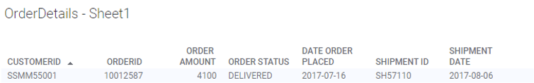
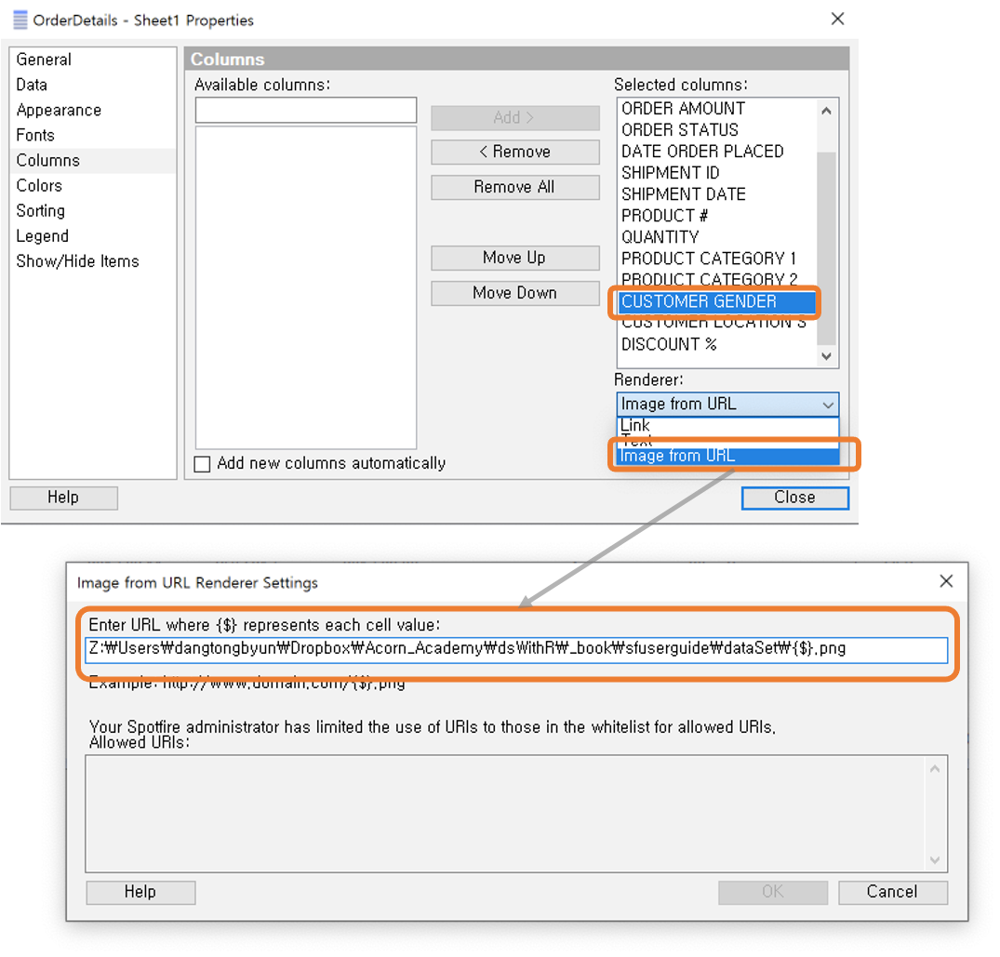
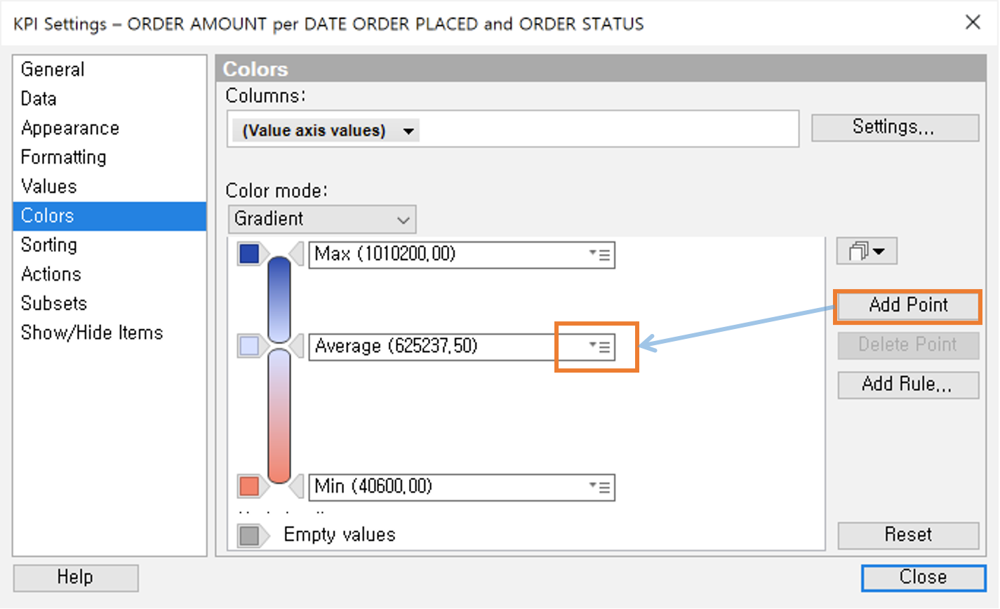
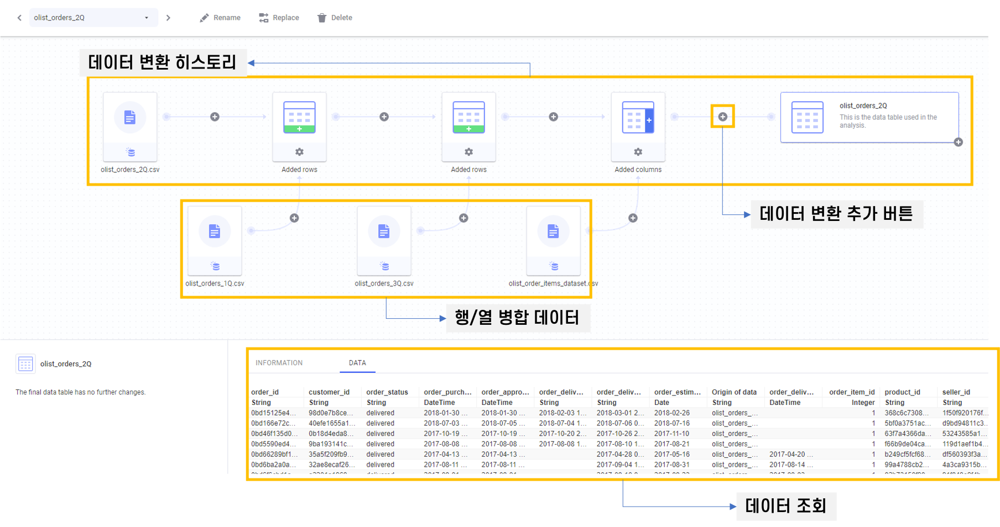
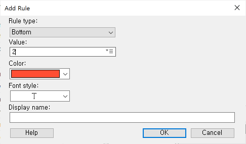

# Spotfire Analyst 데이터 시각화 첫걸음

본 고재는 Spotfire 10.10.2 기준으로 2020년 12월 에 작성 되었습니다.

작성자 : 변현창 bhyuncha@tibco.com

[toc]

## 1.시작하기

### 1.1 Spotfire 접속하기

### 1.2 화면 둘러보기

#### 시작 화면


## 2. 데이터 로딩

### 데이터를 로딩하는 3가지 방법

- Drag & Drop : 내 컴퓨터에 있는 파일을 Spotfire 영역 내로 끌어당겨 데이터를 로드 합니다.
- <kbd>File</kbd>  → <kbd>Open</kbd> : 메뉴 바를 통해 데이터를 로드 합니다.
- Clipborad : 엑셀 이나 메모장의 데이터를 클립보드에 복사 ( <kbd>Ctrl + C</kbd> ) 하여 데이터를 로드하는 방법

## 3. 시각화 기본

### 3.1 Table Chart

#### 3.1.1 데이터 로딩

dataSet 폴더에서 OrderDetails.xls 파일을 로딩 합니다.

<kbd><a href="./dataSet/OrderDetails.xls?dl=1">데이터셋 다운로드 클릭</a></kbd>

#### 3.1.2 차트생성

시각화에서 테이블 아이콘을 드래그 해서 옮겨 놓습니다.


#### 3.1.3 컬럼순서 변경 및 소팅

**CUSTOMERID** (컬럼명) 을 클릭 하면 팝업 창이 뜨고 <kbd>Move First</kbd> 를 클릭해서 컬럼을 가장 앞쪽으로 이동 시킵니다.


#### 3.1.4 정렬하기

**CUSTOMERID** 를 누르면 팝업 창이 뜨게되고 오름차순 정렬 아이콘을 클릭 합니다. 컬럼이름 옆에 세모아이콘으로 오름차순 혹은 내림차순 정렬인지 확인 할 수 있습니다.


#### 3.1.5 컬럼 헤더 크기 조정

**Properties(속성)** 에서 <kbd>Appearance</kbd> 항목에서 **Header row height** 항목에 **3**을 입력 합니다


컬럼 헤더의 높이를 조정 하면 컬럼의 수가 많을 때 한화면에 많은 컬럼을 볼수 있도록 해주는 효과가 있습니다. 아래 그림과 같이 컬럼 이름이 2~3개 행으로 나뉘어 컬럼이 좁아지게 됩니다.



#### 3.1.6 열고정


#### 3.1.7 테이블에 이미지 사용하기

**Properties(속성창)** 에서 <kbd>Columns</kbd> → <kbd>Selected columns</kbd> 에서 **CUSTOMER GENDER** 를 선택 합니다. **Renderer** 에서 <kbd>image from URL</kbd> 을 선택 하면 팝업 창이 뜨게 됩니다.

이미지 파일이 존재하는 폴더를 경로에 입력합니다. 중요한것은 파일의 이름이 **CUSTOMER GENDER** 의 값 과 이름이 동일해야 합니다. 따라서 파일명은 **{$}** 로 변수 처리 합니다.



Allowed URIs 에 허용된 URI 가 없는 것을 확인 할 수 있습니다. 보안상의 이유로 허용된 URI 를 등록(whitelist) 해야 이미지 ACCESS 가 가능합니다. 아래는 Administrator 가 접근 가능한 URI 리스트(whitelist) 를 설정 하는 방법 입니다. 일반 적으로 기업내에 HTTP 로 접근 가능한 디렉토리를 서비스하고 해당 장소에 모든 이미지를 올려 두면 좋습니다.

- Administrator의 Whitelist 설정 방법 : <kbd>Tools</kbd>→<kbd>Administration manager</kbd> 를 클릭해서 관리자 화면으로 들어갑니다.
- <kbd>Perference</kbd> 탭에서 URI 를 허용할 그룹을 선택 합니다. (화면에서는 Everyone 그룹)
- <kbd>Applications</kbd>→<kbd>Application Preference</kbd>→<kbd>Whitelist Allowed URIs</kbd> 에 허용하는 URI 를 "," 를 구분자로 하여 여러개를 입력 할수 있습니다.


> 기본적으로 Spotfire Desktop 은 서버 로그인이 필요 없기 때문에 <Spotfire 설치 폴더>/modules/Spotfire DXP Forms\_\* 디렉토리 밑의 Desktop_Preference_WhitelistForSecuritySensitiveUris 셋팅에 Value 에 허용할 URI 리스트를 입력하면 됩니다. (재 시작 필요)

```{xml}
[....]
      <setting name="Desktop_Preference_WhitelistForSecuritySensitiveUris" serializeAs="String">
아래 Value 항목에 ',' 을 기준으로 여러 개를 입력하면 됩니다.        <value>http://example.com/some/very/special/deep/path/,http://*.example2.com/,http://*.example3.com/some/
path/</value>
      </setting>
    </Spotfire.Dxp.Application.Properties.Settings>
  </applicationSettings>
  <startup><supportedRuntime version="v4.0"
sku=".NETFramework,Version=v4.5"/></startup>
</configuration>
```

#### 3.1.8 결과 화면


### 3.2 Bar Chart (막대 그래프)

#### 3.2.1 데이터 로딩

dataSet 폴더에서 OrderDetails.xls 파일을 로딩 합니다.

<kbd><a href="https://www.dropbox.com/s/q3ao4rfqscylw76/OrderDetails.xls?dl=1">데이터셋 다운로드 클릭</a></kbd>

#### 3.2.1 검색으로 부터 그래프 그리기

화면 우측 상단의 검색 아이콘을 클릭 하거나 <kbd>Ctrl </kbd>+<kbd>F</kbd> 를 누르게 되면 아래와 같이 검색 화면이 보이게 됩니다. Spotfire 에서는 변수, 그래프, 페이지, 테이블 등 다양한 영역에 대해 검색을 동시에 진행하고 결과를 바로 보엽 줍니다.

- 변수명인 **Product Category 2** 를 입력합니다.
- 검색 결과로 나온 (View Row Count per RRODUCT CATEGORY 2) 그래프를 선택 합니다.


#### 3.2.2 Stacked Bar Chart (누적 막대그래프) 만들기

- **Data in Analysis** 에서 **ORDER STATUS** 를 오른쪽 시각화 영역으로 아래 그림과 같이 Drag and Drop 을 수행 합니다.
- **Colored by ORDER STATUS**를 선택 합니다.


#### 3.2.3 Horizontal Bar Chart (수평막대차트) 만들기

시각화 영역에서 오른쪽 마우스 버튼을 클릭 한뒤 <kbd>**Horizontal Bars**</kbd> 및 <kbd>**Side-by-Side Bars**</kbd>를 클릭 합니다.


#### 3.2.4 100% Stacked Bar Chart 만들기

- 신규 페이지를 추가로 생성 합니다.
- **Data in Analysis** 에서 **ORDER AMOUNT** 와 **PRODUCT CATEGORY 2** 를 선택 하면 그래프 추천 항목에서 **View ORDER AMOUNT per PRODUCT CATEGORY 2** 시각화를 선택 합니다.


- 오늘쪽 상단의 범래(Legend) 에서 **Color by** 의 **None** 을 클릭하게 한뒤 **ORDER STATUS** 를 클릭 합니다.


- 마우스 오른쪽 버튼을 클릭해서 **100% Stacked Bars** 를 클릭 합니다.


-


#### 3.2.5 Histogram 차트

- 신규 페이지를 하나 더 생성 합니다.
- **시각화 메뉴**에서 **Bar Chart ** 를 드래그 해서 현재 페이지에 Drop 합니다.


- X축 인자에 **QUANTITY** 를 선택 하게 되면, 막대 그래프가 얇게 변하게 됩니다.
- Y축 인자로 **ORDER AMOUNT** 를 선택 합니다.


-


- X축의 **QUANTITY** 에 있는 슬라이드 막대를 클릭 하면 BINNING 개수를 조정 할수 있습니다.
- X축의 **QUANTITY** 를 오른쪽 마우스 클릭해서 **Number of Bins** 를 클릭해서 직접 개수를 입력 할 수도 있습니다.


### 3.3 Line Chart (선 그래프)

#### 3.3.1 데이터 로딩

dataSet 폴더에서 **Seoul-Air.csv** 파일을 로딩 합니다.

<kbd><a href="./dataSet/Seoul-Air.csv">데이터셋 다운로드 클릭</a></kbd>

아래 표는 데이터셋에 포함된 변수에 대한 설명 입니다.

| 변수명 | 설명        |
| ------ | ----------- |
| CO     | 일산화탄소  |
| NO2    | 이산화 질소 |
| O3     | 오존        |
| SO2    | 아황산가스  |
| PM10   | 미세먼저    |
| PM2.5  | 초미세먼지  |

#### 3.3.2 그래프 생성


#### 3.3.3 다변량 선 그래프

- 하나의 차트에 여러가지 선을 그리기 위해 **CO**, **PM2.5**, **PM10** 세 변수를 선택 하여 드래그 한다음 아래 화면과 같이 **Y축** 인자로 DROP 합니다.
- 집계가 기본이 SUM 이기 때문에 **AVG** 로 모두 바꿔 줍니다.


#### 3.3.4 멀티축 설정

- 일산화탄소인 **CO** 의 변화량을 확인하기 힘들다는 것을 알수 있습니다.
- **Y** 측에 대고 오른쪽 마우스를 클릭하면 Scale 3가지 옵션중 **Dual Scale** 을 선택 합니다.
- **Y** 축에 있는 **CO2** 를 드래그 해서 우측에 새로생긴 **Y축** 으로 옮겨서 Drop 합니다.

> 멀티축을 사용하는 것은 값의 범위(Range) 가 서로 다른 변수들의 트랜드를 보기 위해 사용 합니다. 멀티 축을 사용하면 같은 축으로 그렸을때 보이지 않던 트랜드가 확실 뚜렷하게 보입니다.


- **Properties**(속성) 의 **Y-axis** 항목에서도 멀티축에 대한 정보를 수정및 조회 할 수 있습니다.

#### 3.3.5 패널 별 선그래프

- 미세먼지를 측정 한 장소별로 보기 위해 **Properties(속성)** 창을 엽니다.
- <kbd>Trellis</kbd> → <kbd>Panels</kbd> 항목에서 **Split by** 항목에 **Address** 를 선택합니다.


FiscalYearOffSet 추가

### 3.4 Scatter Plot (산점도)

#### 3.4.1 데이터 로딩

dataSet 폴더에서 **Apt-price-2019-songpa.csv** 파일을 로딩 합니다.

<kbd><a href="./dataSet/Apt-price-2019-songpa.csv">데이터셋 다운로드 클릭</a></kbd>

#### 3.4.2 그래프 생성

- **시각화 메뉴** 에서 **Scatter Plot** 을 드래그 해서 시각화 화면에 DROP 합니다.


- X축을 **deal_ymd** (Year >> Quater >> Month >> Day of Month) 로 설정 하세요
- Y축을 **price_by_area** 로 설정하세요


#### 3.4.3 점의 크기 조정 및 Jittering

- X축에 마우스 왼쪽을 클릭하여 점의 크기와 Jittering 을 수행 합니다.
- Y축에 마우스 왼쪽을 클릭하여 Jittering 을 수행 합니다.
- Jittering 은 겹쳐진 점이 보이게 하기 위해 Random 값으로 일정하게 분산 시키는 효과를 가집니다.


> 산점도에서 겹쳐진 점을 보이게 하는 방법은 크게 Jittering 과 투명도를 높이는 두가지 방법이 있습니다. 투명도의 경우에는 완전히 겹쳐진 점에 대해서는 좀더 색깔이 진해 지는 형태로 데이터가 많이 몰려 있는걸을 확인 할 수 있습니다.

#### 3.4.4 점의 모양 / 크기 / 투명도 변경

- **Properties(속성)** 창에서 <kbd>Appearance</kbd> → <kbd>Transparency</kbd> 에서 적당한 투명도로 조정 합니다.
- **Properties(속성)** 창에서 <kbd>Size</kbd> → <kbd>Sized by</kbd> 에 **size** 를 선택 합니다.
- **Properties(속성)** 창에서 <kbd>Shape</kbd> → <kbd>Shape definition</kbd> 에서 정사각형으로 선택 합니다.


- 결과 화면 : 이전보다 훨씬 명확하게 트랜드를 구분 할수 있습니다.


#### 3.4.5 패널 추가 및 회귀선

- **Properties(속성)** 에서 <kbd>Trellis</kbd> → <kbd>Panels</kbd> 에서 **apt_name** 을 선택 합니다.
- <kbd>Lines & Curves</kbd> → <kbd>Add</kbd> → <kbd>Straight Line Fit...</kbd> 을 클릭해서 팝업창이 뜨면 <kbd>OK</kbd> 클릭
- <kbd>Lines & Curves</kbd> → <kbd>Label and Tooltip </kbd> 클릭후 팝업창이 뜨면 **R^2 of the regression(r2)** 를 선택 합니다.


- 결과 화면 : R^2 값은 모델의 설명력을 표현합니다. 회귀선을 그렸을때 회귀선이 얼마나 주어진 데이터를 잘 설명하는지에 대한 척도 입니다.


## 4. Marking & Filtering

#### 4.1 Marking(마킹)

#### 4.1.1 데이터 로딩

dataSet 폴더에서 **Mark-Filter-Export.dxp** 파일을 로딩 합니다. 로딩 하게 되면 아래와 같은 화면이 보입니다.

<kbd><a href="./dataSet/Mark-Filter-Export.dxp">DXP 다운로드 클릭</a></kbd>

- 막대 차트의 일부를 선택 하게 되면 오른쪽 **Table 차트** 에 마킹된 값만 하이라이트 됩니다.


#### 4.1.3 새로운 Marking 만들기

- <kbd>File</kbd>→<kbd>Document properties</kbd> 를 클릭 합니다.
- **Document Properties** 에서 <kbd>Marking</kbd> → <kbd>New</kbd> 를 클릭 합니다.
- 아래와 같이 색상을 선택한 다음 **myMarking** 을 입력하고 <kbd>OK</kbd>


#### 4.1.4 새로운 Marking 적용하기

- **Bar Chart** 의 **Properties(속성)** 창을 엽니다
- <kbd>Data</kbd> → <kbd>Marking</kbd> 에서 **myMarking** 을 선택 합니다.
- <kbd>Legend</kbd> 의 **Display the following legend items** 에서 **Marking** 을 선택 합니다.
- <kbd>Appearance</kbd> 에서 **Use separate color for marked items** 를 체크 합니다.


- 이제 막대 그래프의 영역을 선택 하면 초록색으로 바뀌지만 , 테이블 차트의 데이터가 Highlight 되지 않습니다.
- 막대그래프의 빈공간을 클릭 하면 마킹이 해지 됩니다.


#### 4.1.5 Table 차트에 신규 마킹을 이용해 데이터 제한하기

- 테이블 차트의 **Properties(속성)** 화면으로 이동 합니다.
- <kbd>Data</kbd> 항목에서 **Marking** 을 Bar Chart 에서 설정한 **myMarking** 으로 변경 합니다.
- <kbd>Data</kbd> 항목에서 **Data limiting** 에서 myMarking 을 체크 합니다.
- <kbd>Data</kbd> 항목에서 **If no item are marked in the master visulaization, show:** 항목에서 **All data** 를 선택 합니다.


- 이제 Bar Chart 에서 선택한 데이터가 없으면, 모든 데이터를 보여주고, 데이터를 Marking 하면 Marking 한 데이터에 대해서만 필터하여 데이터를 보여 줍니다.


#### 4.1.6 데이터에 필터 적용하기

- **데이터 메뉴** 에서 **Total Amount of Purchases** 를 클릭 하면 오른쪽에 **깔때기** 아이콘을 클릭 해서 슬라이드 바를 조정 해서 필터링을 적용 할수 있습니다.
- 변수에 적용된 필터는 **데이터 메뉴** 하단에 **Clear selections** 항목에 표시 되어 현재 데이터 레벨에서 적용된 필터를 한눈에 확인 할수 있고, 삭제도 할 수 있습니다.


- **X** 버튼을 눌러서 필터를 해지 합니다.

#### 4.1.7 필터 패널 사용하기

- 필터 패널을 사용하기 위해서는 오른쪽 상단의 필터 바로가기 버튼을 클릭 합니다.
- 필터 패널에서 **Store Location** 을 찾아 오른쪽 마우스 버튼을 클릭 합니다.
- **Filter Type** 을 **Radio Button Filter** 로 변경 합니다.


- 패널 필터를 조정 하면서 두번째 페이지의 데이터가 어덯게 필터링 되는지 확인 해봅니다.

#### 4.1.8 신규 패널 만들기


## 5. 파일 저장 하기

### 5.1 DXP 파일 저장 하기

- 현재 열고 있는 Mark-Filter-Export.dxp 파일을 저장 해보겠습니다.
- <kbd>File</kbd>→<kbd>Save as</kbd> 를 클릭 합니다.


### 5.2 Spotfire 의 문서 구조 이해


## 6. 시각화 2편

### 6.1 Parallel Coordinate Plot (평행 좌표)

> tutorialFiles/iris.csv 파일을 엽니다.
>
> iris 데이터셋은 아래와 같은 항목을 가지고 있습니다.

| 항목         | 의미          |
| ------------ | ------------- |
| Petal.Length | 꽃잎의 길이   |
| Petal.Width  | 꽃잎의 폭     |
| Sepal.Length | 꽃받침의 길이 |
| Sepal.Width  | 꽃받침의 폭   |

#### 6.1.1 파일불러오기

<kbd>File</kbd> → <kbd>Open</kbd> → <kbd>Browse local file </kbd> 을 선택하여 **SfDataSet** 디렉토리의 iris.csv 파일을 불러 옵니다.

<kbd><a href="./dataSet/iris.csv">데이터셋 다운로드 클릭</a></kbd>

#### 6.1.2 Parallel Coordinate Plot 그리기

- 시각화에서 <kbd>Parallel coordinate plot</kbd> 을 드래그 합니다.


- X축의 에 마우스를 올리고 **회색** 으로 변하면 <kbd>왼쪽 마우스 버튼</kbd>를 클릭 합니다. <kbd>select columns</kbd> 를 클릭 하면 차트에 사용 할 컬럼을 선택 할 수 있습니다.


- 결과 화면


#### 6.1.3 집계 적용하기

- 다시 **Properties(속성)** 에서 <kbd>Line By</kbd> 를 클릭 한뒤, 항목을 **Species** 를 선택 합니다.


- 아래와 같이 붓꽃의 종류별로 단일 선으로 표시 됩니다. 기본은 **SUM** 함수를 이용해 모두를 더한 값이 표시 됩니다.


- 붓꽃 각각의 넓이와 길이를 평균으로 표시 하기 위해 **Properties(속성)** 창을 다시 열어 <kbd>Columns</kbd> 항목을 클릭하고 **Aggregation** 함수를 **Sum** 에서 **Average** 로 변경 합니다.


### 6.2 Box Plot (상자 도표)

#### 6.2.1 파일 불러오기

<kbd>File</kbd> → <kbd>Open</kbd> → <kbd>Browse local file </kbd> 을 선택하여 **dataSet** 디렉토리의 **ItemDetails.txt** 파일을 불러 옵니다.

<kbd><a href="./dataSet/ItemDetails.txt">데이터셋 다운로드 클릭</a></kbd>

#### 6.2.2 BoxPlot 그리기

-


#### 6.2.3 참조점을 추가

- **Properties(속성)** 창 에서 **Reference Points** 를 선택한뒤 Avg(평균), Min(최소값), Max(최대값) 을 선택하고 Min, Max 의 경우 **Line** 항목을 2중선으로 설정 합니다.


#### 6.2.4 참조 정보 추가

- 시각화 화면에 <kbd> 오른쪽 마우스 버튼</kbd> → <kbd>Statistics Table</kbd> 을 선택하면 아래와 같이 참조 정보를 추가 및 해지 할 수 있습니다. 참조 정보는 X축 밑에 표 형태로 출력이 됩니다.


#### 6.2.4 데이터 분포 표시하기

**Properties(속성)** 창에서 **Apperance** 를 선택 한뒤 **Show distribution** 을 체크 합니다. 아래 그림과 같이 BoxPlot 에서 전체적인 데이터 분포를 보여 주는 그래프가 완성 되었습니다.


### 6.3 KPI 차트

#### 6.3.1 데이터 불러오기

- 새로운 페이지를 만들고 **KPI 차트** 라고 이름을 붙여 봅니다.
- <kbd>File</kbd> →<kbd>Open</kbd> →<kbd>Browse local file</kbd> 을 클릭해서 **OrdersDetails.xls** 를 불러 옵니다.

<kbd><a href="./dataSet/OrderDetails.xls">데이터셋 다운로드 클릭</a></kbd>

#### 6.3.2 차트 생성

- **시각화 메뉴** 에서 **KPI Chart** 를 드래그 해서 시각화 영역으로 Drop 합니다.

  Settings</kbd> 를 클릭 하게 되면 KPI Setting 팝업창이 뜹니다.
- Value(y-axis)에는 **Sum(ORDER_AMOUNT)** 를 선택 합니다.
- **Show time in tile** 를 선택 합니다.(체크박스)
- **Tile by** 항목 에서는 **ORDER_STATUS**
- Comparative value 의 항목은 Sum(QUANTITY) 로 선택 합니다.


- **Colors ** 항목 에서 <kbd> Add Point</kbd> 를 클릭해서 중간 색상 지점을 추가 합니다.
- 중간 지점의 색상을 적당한 색상으로 바꾸고 리스트박스 를 클릭해서 Average 값으로 설정 합니다.



- **Appearance** 항목에서 **Show scale** 및 **Include Origin** 을 체크 합니다.
- 라디오 버튼에서 **Multiple scales** 를 선택 합니다.


- 최종 화면


## 7. 관계형 테이블 및 변환

</ 병합에 사용되는 데이터셋에 관해 간략하게 요약 해보면 아래와 같습니다. 실습 대상이 되는 데이터는 Olist 라는 브라질 온라인 쇼핑몰의 실제 데이터 입니다.

> 출처 : https://www.kaggle.com/olistbr/brazilian-ecommerce

| 파일명                                                                                                                                | 내용                                     |
| ------------------------------------------------------------------------------------------------------------------------------------- | ---------------------------------------- |
| olist_orders_1Q.csv <kbd><a href="./dataSet/olist_orders_1Q.csv">데이터셋 다운로드 클릭</a></kbd>                                     | 1분기 고객 주문 데이터                   |
| olist_orders_2Q.csv <kbd><a href="./dataSet/olist_orders_2Q.csv">데이터셋 다운로드 클릭</a></kbd>                                     | 2분기 고객 주문 데이터                   |
| olist_orders_3Q.csv <kbd><a href="./dataSet/olist_orders_3Q.csv">데이터셋 다운로드 클릭</a></kbd>                                     | 3분기 고객 주문 데이터                   |
| olist_order_items_dataset.csv <kbd><a href="./dataSet/olist_order_items_dataset.csv">데이터셋 다운로드 클릭</a></kbd>                 | 고객이 주문한 ITEM 데이터                |
| olist_customers_dataset.csv <kbd><a href="./dataSet/olist_customers_dataset.csv">데이터셋 다운로드 클릭</a></kbd>                     | 고객정보                                 |
| olist_order_payments_dataset.csv <kbd><a href="./dataSet/olist_order_payments_dataset.csv">데이터셋 다운로드 클릭</a></kbd>           | 고객구매시 지불 정보                     |
| olist_order_reviews_dataset.csv <kbd><a href="./dataSet/olist_order_reviews_dataset.csv">데이터셋 다운로드 클릭</a></kbd>             | 고객 구매 상품에 대한 리뷰               |
| product_category_name_translation.csv <kbd><a href="./dataSet/product_category_name_translation.csv">데이터셋 다운로드 클릭</a></kbd> | 상품 카타고리에 대한 영어 메뉴 번역 정보 |

### 4.1 데이터 자동 병합 하기

#### 4.1.1 데이터 불러오기

우선, 3개 파일을 Spotfire <kbd>File</kbd> → <kbd> Open</kbd> → <kbd>Browse local file</kbd> 을 통해 불러 옵니다.<br>대상파일 : olist_orders_1Q.csv, olist_orders_2Q.csv, olist_orders_3Q.csv, olist_order_items_dataset.csv (4개)


#### 4.1.2 데이터셋 검사 및 Import

아래와 같이 각각의 데이터셋 마다 검증하고 필요 할경우 변환할 수 있는 인터페이스를 제공 합니다. 4개의 파일에 대해 모두 <kbd>OK</kbd> 를 클릭 해서 데이터를 Import 합니다.


#### 4.1.3 데이터 추천 병합 하기

기본적으로 Spotfire 는 데이터의 모양을 보고 데이터를 열 또는 행으로 결합 할지 아니면 각각의 독립된 데이터셋으로 Import 할지를 추천 해줍니다.


- Olist_order_items_dataset 에 대해 <kbd>Add as new data table</kbd> → <kbd> Add as columns to </kbd> 를 클릭 합니다.
- <kbd>설정(톱니바퀴)</kbd> 버튼을 누르면 팝업 창이 뜨게됩니다.
- 컬럼으로 병합 (조인) 하는 것이기 때문에 **Match Columns** 항목을 통해 **조인 키**를 설정해야 합니다.
- Spotfire 가 조인키를 데이터 형태를 보고 추천한 데로 진행합니다. <kbd>OK</kbd> 클릭 합니다.


- 데이터 Spotfire 가 Import 하는 과정에서 몇가지 경고 사항이 나타 납니다. 'NA' 라는 문자열이 날짜 데이터 타입의 형식에 맞지 않아 Spotfire 는 **'NA' 를 공백으로 처리** 하지만, 경고 메시지를 남기는 겁니다.


- 데이터 Import 가 완료되면 Data Canvas 가 구동되게 됩니다.



## 8. Column Operation

### 8.1 Column Add (컬럼 추가하기)

#### 8.1.1 데이터 로딩

- dataSet 폴더에서 **OfficeSupplies.txt** 파일을 엽니다.

<kbd><a href="./dataSet/OfficeSupplies.txt">데이터셋 다운로드 클릭</a></kbd>

#### 8.1.2 Table Chart 추가


#### 8.1.3 일부 컬럼 만 표시 하기

-


#### 8.1.4 Over 함수를 이용한 표현식 만들기

- 아래 화면과 같이 표현식을 완성 합니다.

  ```{php}
  Sum([Sales]) OVER [Market Segment]
  ```


- 최종 결과


### 8.2 OVER in Custom Expression

#### 8.2.1 새로운 페이지 추가

- 새로운 페이지를 추가하고 **Bar Chart** 를 생성 합니다.

#### 8.2.2 사용자 정의 표현식 생성

- X축을 클릭


- **Y축** 을 클릭 해서 **Edit expression** 부분에 아래와 같은 표현식을 입력 합니다.

```{php}
Sum([Sales]) / Sum([Sales]) OVER ALL([Axis.X])
```


#### 8.2.3 Bar Chart 속성 설정

- Bar Chart 의 **Properties(속성)** 설정으로 이동하여 아래와 같이 설정 합니다
- **Formmatting** 에서 신규로 설정한 축을 선택하고 **Category** 를 **Percentage** 로 선택하고 **Decimals** 항목을 1로 설정 합니다. 1은 소수점 첫째까지만 표기 하라는 뜻입니다.
- **Tooltip** 항목으로 이동해서 **Show labels for** 를 **All** 로 설정하고 **Types of labels** 내의 **Bar segments** 를 체크 합니다.


- 최종 결과


## 9. 시각화 3편

### 9.1 Map 차트

#### 9.1.1 데이터 로딩

<kbd>File</kbd> → <kbd>Open</kbd> → <kbd>Browse local file </kbd> 을 선택하여 **dataSet** 디렉토리의 **Global Data.xls** 파일을 불러 옵니다.

<kbd><a href="./dataSet/Global Data.xls">데이터셋 다운로드 클릭</a></kbd>

#### 9.1.2 맵차트 그리기


#### 9.1.3 맵차트 둘러보기

- 왼쪽상단의 레이어 아이콘을 클릭 합니다.
- 레이어 아이콘의 체크 박스를 눌러 봅니다.


- 오른쪽 상단의 검색을 클릭 하고 **Korea** 라고 검색 합니다.
- 오른쪽 산단의 검색을 클릭 하고 **United States** 라고 검색 합니다.


- Zoom In / Zoom Out 을 클릭 합니다
- 메뉴 화면의 Undo 버튼을 클릭 하면 이전 검색 화면 으로 돌아 갑니다.

#### 9.1.4 위치 좌표

- 맵차트의 **Properties(속성)** 창을 엽니다.
- **Layers** 항목에서 **Marker Layer** 를 선택하고 <kbd>Settings</kbd> 를 클릭 합니다.
- Marker 레이어의 셋팅에서 **Positioning** 을 선택하고 밑으로 내려보면 **Coordinate columns** 하는 항목이 나오고 위/경도를 가지 변수(컬럼)을 지정하는 항목이 나옵니다.


#### 9.3.3 Properties 설정

- Summary Table 의 **Properties(속성)** 설정 창으로 이동 합니다.
- **Columns** 탭에서 **Store Number, Customer age, Departments shopped** 컬럼을 삭제 합니다.
- **Columns** 탭에서 **Total Amount of Purchases** 컬럼를 추가 합니다.

** 를 추가 합니다.


- 최종 화면


### 9.4 Cross Table

#### 9.4.1 데이터 로딩

dataSet 폴더에서 **전체거래테이블.csv** 파일을 로딩 합니다.

<kbd><a href="./dataSet/전체거래테이블.xlsx">데이터셋 다운로드 클릭</a></kbd>

#### 9.4.2 Cross Table 그리기

- 시각화 메뉴 에서 **Cross Table** 을 Drag 해서 시각화 영역으로 Drop 합니다.


#### 9.4.3 수직축 에 계층 설정

- <kbd> Data</kbd>→<kbd>Add Hierarchy</kbd> 를 클릭 합니다.
- 아래와 같이 **제품 대분류**, **제품 중분류**, **제품ID** 순으로 계층을 추가 합니다.
- 이름은 **제품계층** 으로 입력 합니다.


- 수직축 컬럼을 마우스로 클릭해서 **제품 계층** 을 선택 합니다.


#### 9.4.4 수평축 설정

- 수평축 컬럼을 마우스로 클릭 해서 **지역** 과 **결제방법** 을 차례대로 추가 합니다.


#### 9.4.5 합계 및 색상 설정

- **Properties** 창으로 이동해서 **Colors** 항목으로 이동 합니다.
- **Color mode** 를 **Gradient** 로 변경 합니다.
- <kbd>Add Point</kbd> 를 클릭하고, 드롭박스 메뉴를 클릭 한다음 **Average** 를 선택 합니다.


- **Totals** 항목으로 이동하여 **Display totals** 에 모든 항목을 선택 합니다.
- **Appearance** 항목으로 이동하여 **Use separate color from marked items** 를 체크 해지 합니다.


- 최종 화면


### 9.5 Graphical Table

#### 9.5.1 데이터 로딩

dataSet 폴더에서 **WeightLOss12WeeksData.xls** 파일을 로딩 합니다.

<kbd><a href="./dataSet/WeightLoss12WeeksData.xls">데이터셋 다운로드 클릭</a></kbd>

#### 9.5.2 Graphical Table 그리기


#### 9.5.3 스파크 라인 설정

- **Properties(속성)** 창으로 이동합니다.
- **Axes** 항목으로 이동한뒤 **Columns** 에서 이미 만들어져 있는 **Sparkline** 을 선택하고 <kbd>Settings</kbd> 를 클릭 합니다.
- **Axes** 항목에서 **X-axis** 를 **Week** 로 설정 합니다.
- **Axes** 항목에서 Y-axis 를 **Sum(Weight, kg)** 로 선택 합니다.
- **Y-axis scale** 항목에서 **Multiple scales** 를 선택 합니다.


> 스파크라인은 라인차트와 같습니다. 따라서 Weight loss 트랜드가 모든 사람에 대해 12주기간 동안 표시 됩니다.

- Sparkline 의 **Appearance** 로 이동 합니다.
- 아래 그림과 같이 **Starting point, End point** 모두를 체크 하고, **LIne width** 를 **2** 로 설정하고 색상을 **파란색** 으로 설정 합니다.


#### 9.5.4 계산된 컬럼 추가하기

- Sparkline 의 **Properties(속성)** 으로 이동 합니다.
- **Axes** 항목에서 <kbd>Add</kbd> 버튼을 클릭해서 **Calulated Value** 를 선택해 추가 합니다.
- **Calculated value Setting** 창에서 **Values** 항목에서 **Calculate values using** 항목을 **Weight Loss, kg** 로 선택하고 집계 함수를 **Sum** 으로 선택 합니다.
- <kbd>Add Rule</kbd> 을 클릭해 팝업창이 나오면, **Rule type** 을 **Top** 으로 선택하고, **Value** 를 **2** 로 설정한뒤, **Color** 를 노란색으로 설정 합니다.


- 동일한 방법으로 <kbd>Add Rule</kbd> 을 클릭 해서 **Rule type** 을 **Bottom** 으로 선택하고, **Value** 를 **2** 로 입력합고, **Color** 를 붉은색으로 설정합니다.



#### 9.5.5 아이콘 컬럼 추가하기

- **Properties(속성)** 창에서 Axes 항목에 <kbd> Add </kbd> 버튼을 클릭해 **ICON** 을 선택해 추가 합니다.
- **Icon Setting** 창의 **Icon** 항목 에서 **Calculate icons using** 항목을 **Weight Loss, kg** 의 집계함수를 **Sum**을 선택 합니다.
- 이미 설정되어 있는 Default Rule 을 편집하기 위해 **연필** 버튼을 클릭합니다.
- 팝업창이 뜨면 **Rule type** 을 **Top** 으로 선택하고 **Value** 를 **2** 로 선택하고 , **Color** 를 연한 노랑으로 선택 합니다.


- <kbd>Add Rule</kbd> 을 클릭 합니다.
- **Rule Type** 을 **Bottom** 으로 설정하고 **Value** 를 **2** 로 설정 하고, **Shape** 에 **X** 마크를 선택 합니다.


#### 9.5.6 Bullet 그래프 추가하기

- **Properties(속성)** 창의 **Axes** 항목에서 <kbd> Add</kbd> 를 클릭하고 **Bullet Graph** 를 선택 합니다.
- **Bullet graph Setting** 창에서 **Calulate values using** 항목은 **Weight Loss, kg** 을 집계함수 **Sum** 으로 설정
- **Calculate comparative values using** 항목을 **Weekly Goal, kg** 로 설정 합니다.
- **Color Range** 항목에서 **Show color rnage** 를 체크 합니다.
- <kbd> Add </kbd> 버튼을 클릭해서 아래와 같이 3가지 생상을 조건과 함께 설정합니다.

```{php}
Sum([Weekly Goal, kg]) * 0.75
Sum([Weekly Goal, kg]) * 1.25
```


- 최종화면


## 10. Property Control

### 10.1 축으로 Property 사용

#### 10.1.1 데이터 로딩

- dataSet 폴더에서 **flights.csv** 파일을 로딩 합니다.

<kbd><a href="./dataSet/flights.csv">데이터셋 다운로드 클릭</a></kbd>

- **시각화 화면** 에서 **Line Chart** 를 드래그 해서 시각화 영역에 Drop 합니다.


- <kbd>File</kbd>→<kbd>Document Properties</kbd> 를 클릭 합니다.
- **Properties** 탭에서 <kbd>New</kbd> 를 클릭하면 Property 편집창이 뜹니다.
- **Property name** 항목에 Page1X 라고 입력하고 **String **을 선택하고 <kbd>OK</kbd> 를 클릭 합니다.
- 다시 <kbd> New </kbd> 를 클릭하고 동일방법으로 Page1Y를 입력 하고 **String** 을 선택하고 <kbd>OK</kbd> 를 클릭합니다.
- 총 2개의 Document Property 를 만들어 습니다.


#### 10.1.2 Text Area 생성

**시각화 메뉴** 에서 **Text area** 를 드래그 해서 시각화영역에 Drop 합니다.


- 텍스트 영역의 오른쪽 상단에 편집버튼(연필모양) 을 클릭 합니다.
- <kbd>Insert Property Control</kbd> 을 클릭 하고 **Drop-Down List** 를 클릭 합니다.

- Property Control 대화 상자가 나타나면, **Document Properties** 탭에서 **Select property** 항목에서 **Page1Y** 를 선택 합니다.
- **Set Property value through** 항목은 **Column selection** 으로 선택 합니다.
- **Settings** 에서 <kbd>Select Columns</kbd> 를 클릭 합니다.
- **Select Columns** 팝업창에서 <kbd>New</kbd> 를 클릭 합니다.
- <kbd>New</kbd> 를 클릭하고, 팝업창의 Property name 항목에 **Page1Y** 라고 동일하게 적어 줍니다.
- Data Type 은 **Boolean** 으로 하고 **Default Value** 는 **TRUE** 로 입력 합니다.


- **Select Columns ** 창에서 모든 변수를 제거하고 **dep_dealy**, **arr_time** , **arr_delay** 3개만 선택 합니다
- page1X 도 위와 동일한 방법으로 설정 하되, **month**, **day**,**carrier**, **tailnum** 4개만 선택 합니다.


- 텍스트 박스 결과


#### 10.1.3 축에 property 설정

- **Y축** 과 **X축** 에 오른쪽 마우스 버튼을 클릭한뒤, **set from Property** 를 클릭 해서 각각의 Document Property 를 설정해줍니다.


- 최종화면


### 10.2 Text 표현식 으로 Property 사용

#### 10.2.1 데이터 로딩

dataSet 폴더에서 **OfficeSupplies.txt** 파일을 로딩 합니다.

<kbd><a href="./dataSet/OfficeSupplies.txt">데이터셋 다운로드 클릭</a></kbd>

#### 10.2.2 Bar Chart 그리기

- 아래와 같이 Bar Chart 를 그립니다.


#### 10.2.3 Text 영역 설정

- Text 편집(연필모양) 을 누르고, 기존에 있던 텍스트 영역에 한칸을 내려 <kbd>Insert Property Control </kbd> 을 클릭해서 **Drop-Down List** 를 하나 더 만듭니다.

- **Drop-Down List** 를 더블클릭 하면 아래와 같이 **Property Control** 에서 **Document Properties** 탭에 <kbd>New</kbd> 를 클릭하여 새로운 Document Property 로 **Property Name** 을 **Value Axes** 라고 하고 **Data Type** 을 **String** 으로 해서 만듭니다.


- 동일한 **Property Control** 에서 **Set property value through** 를 **Expression** 으로 선택 하고 <kbd> Add </kbd> 를 클릭해서 아래와 같이 2가지의 Setting 을 추가 합니다.
- Text 영역을 저장 합니다.


- 최종 추가 모습


#### 10.2.5 Expression 으로 Property 설정

- **Y축** 에 ** Custom Expression** 을 클릭하게 되면 Custom Expression 창이 뜹니다.
- 원래 있던 표현식을 지우고 **Available properties for column** 항목에서 **ValueAxes** 를 스크롤 다운해서 선택 한다음 <kbd>Insert Properties</kbd> 를 클릭 하면 자동으로 값이 들어 갑니다.
- Expression 을 복사해서 **Display name** 에도 동일한 표현식을 넣어 줍니다.


- 최종 모습


### 10.3 Value 로 Property 사용

#### 10.3.1 새로운 페이지 추가

- 새로운 페이지를 만들고 , 테이블 차트 를 추가 합니다.
- 출발 지연율에 대한 기준을 5분으로 설정 하고 5분이 넘으면 위반 5분 이하면


#### 10.3.2 테이블 차트의 컬럼 속성을 자동으로 변경

- 테이블 차트에서 **Properties(속성)** 으로 이동하고 **Columns** 항목을 선택 한 다음 **Selected columns** 에서 모든 변수를 <kbd>Remove ALL </kbd> 을 클릭해서 제거 합니다.
- **flight, dep_dealy, tailnum, carrier** 만 추가 해줍니다.
- 하단에 있는 **Add new columns automatically** 를 체크 합니다.


#### 10.3.3 Text Area 추가 및 설정

- Text 영역을 추가 해줍니다.
- 추가한 Text 영역에 **Insert Property Control** 을 클릭해서 **Slide Bar** 를 추가해 줍니다.
- **Property Control** 창에서 <kbd>New</kbd> 를 클릭해서 **Property name** 에 **DepDelayViolated** 를 입력하고 **Data Type** 을 **Integer 으로 선택 하고, **Value** 를 **5\*\* 로 설정한 뒤 <kbd>OK</kbd>


- 동일한 Property Control 에서 **DepDelayViolated** 범위를 아래와 같이 지정 합니다.
- **Set property value through** 항목에서 **Numerical range** 를 선택합니다.
- **Min : 1**, **Max: 20, Value Interval: 1** 로 설정하고 **Show min and max labels** 를 체크 합니다.


#### 10.3.4 Calculated Column 추가

- <kbd> Data</kbd>→<kbd>Add Calulated Column</kbd> 을 클릭 합니다.
- **Available properties for column** 항목에서 **DepDelayViolated** 를 찾아 **Insert as Value** 로 표현식에 입력 합니다.
- 표현식은 아래와 같습니다.

```{php}
if(([dep_delay] -DocumentProperty("DepDelayViolated") > 0), "Violated", "Passed")
```

- **Column name** 은 Violoated 로 입력 합니다.


- 최종 화면


## 11. 머신러닝

## 12. Data Function with R

### 12.1 Data Function 만들기

#### 12.1.1 Data Functio 등록 하기

- **Tools** 의 **Register data functions** 을 클릭 하고 , **Name** 을 **KMeansClustering** 이라 고 입력 합니다.

- **Type** 을 Drop-Down List 에서 **R script - TIBCO Enterprise Runtime for R** 을 선택 합니다.

- 설명란에 **나의 첫번째 데이터 함수 ** 라고 입력 합니다.

- **Script** 입력 창에 아래와 같이 입력 합니다.

  ```{R}
  cl <- kmeans(data.frame(x,y), k)
  cl.cluster <- data.frame(cluster = cl$cluster)
  cl.centers <- data.frame(cluster=1:k, cl$centers, size=cl$size)
  ```

#### 12.1.2 Input 파라메터 설정 하기

- **Input Parameters** 탭을 클릭 합니다.
- <kbd>Add</kbd> 를 클릭하고 **Input parameter name** 을 **x** 로 입력 합니다.
- **Display name** 을 **x - axis value** 입력 합니다.
- **Type** 은 **Column** 을 선택 합니다.
- **Allowed data types** 에 **Integer, Real, SingleReal, Currency** 4개를 체크 한뒤 <kbd> OK </kbd> 를 클릭 합니다.


- 다시 **Script** 탭으로 이동 합니다.
- y 변수를 하이라이트 해서 오른쪽 마우스를 클릭 해서 **Input Parameter** 를 클릭 합니다.
- **Input Parameter name** 에 **y** 를 입력 합니다.
- **Display name** 에는 **y - axis values** 라고 입력 합니다.
- **type** 은 **Column** 으로 하고 **Allowed data types** 는 **Integer, Real, SingleReal, Currency** 를 체크 한뒤 <kbd> OK </kbd> 를 클릭 합니다.


- 동일한 방법으로 변수 k 에대해서 아래와 같이 실행 합니다.


- **Input Parameter** 탭에서 최종적으로 아래와 같이 보입니다.


#### 12.1.3 Ouput 파라메터 설정

- **Output parameter** 탭을 선택 하고, <kbd> Add </kbd> 버튼을 클릭 합니다.
- **Result parameter name** 을 **cl.cluster** 로 입력 합니다.
- **Display name** 을 **Cluster assignments** 로 입력 합니다.
- **Description** 에 **데이터 포인트에 대한 클러스터 할당 결과** 로 입력 하고, <kbd> OK </kbd> 클릭 합니다.


- <kbd> Add </kbd> 를 클릭 해서 신규 Output parameter 를 추가 합니다.
- **Result parameter name** 을 **cl.centers** 라고 입력 합니다.
- **Display name** 을 **Cluster centers** 로 입력합니다.
- **Description** 에는 **클러스터의 크기 및 클러스터의 좌표** 라고 입력 합니다.


- Output 파라메터 부분은 최종적으로 아래와 같습니다.


#### 12.1.4 Data Function 저장하기

- <kbd> Save as</kbd> 를 클릭 합니다.
- **Name** 을 **KMeansClustering** 으로 저장 합니다.


#### 12.2 Data Function 실행 하기

#### 12.2.1 Dxp 불러오기

- dataSet 폴더에 Lab_W.dxp 파일을 로딩 합니다.
- 로딩이 완료 되면 아래와 같이 Scatter Plot 이 보이게 됩니다.


#### 12.2.2 라이브러리로 부터 Data Function 불러오기

- 메뉴 **Data** →**Data function properties** 를 클릭 합니다.


#### 12.2.3 Input 파라메터 편집

- **Input** 탭 에서 **x - axis value** 를 마우스로 선택 합니다.
- **nput handler** 섹션에서 **Column** 을 선택 합니다.
- 라디오 버튼에 **Columns** 가 선택 되어 있으며, <kbd> Select Columns </kbd> 를 클릭해서 변수 **X** 추가 합니다.
- 스크롤다운 하면 **Limit by** 섹션이 보이고 **Filtered rows** 를 **Filtering Scheme (842 rows)** 로 선택 합니다.


- 동일한 **Input** 탭에서 이제 **y - axis values** 마우스로 선택 합니다.
- **nput handler** 섹션에서 **Column** 을 선택 합니다.
- **Column** 항목을 **Y** 로 선택 합니다.
- **Limit by** 섹션에서 **Filtered row** 항목을 **Filtering scheme (842 rows)** 로 설정 합니다.


- 동일한 **Input** 탭에서 이제 **Desired number of clusters** 를 선택 합니다.
- **Input handler** 섹션에서 **Document property** 를 선택 합니다.
- **Property** 섹션에서 **NoOfClusters** 를 선택 합니다.


#### 12.2.4 Output 파라메터 편집

- 이제 **Output** 탭으로 이동 합니다.
- **Output parameters** 항목에 **Cluster assignments** 를 선택 합니다.
- **Output handler** 에서 **Columns** 를 선택합니다.
- **Map to input rows** 항목을 **x - axis value** 로 선택 합니다.


- 이제 **Output Parameters** 에서 **Cluster centers** 를 선택 합니다.
- **Output handler** 를 **Data table** 로 선택 합니다.
- 상단의 **Refresh function automatically** 를 체크 합니다.
- <kbd> OK </kbd> 를 클릭 합니다.


#### 12.2.5 결과 보기

- 아래와 같이 데이터 메뉴에 **Cluster** 라는 신규 변수가 생기고, 신규 데이터 셋으로 **Cluster centers** 라는 것이 만들어 졌습니다.

- cluster 를 마우스로 Drag 해서 격자형 패널 아이콘에 Drop 합니다.

  <img src="./img/sfUserGuide/image-20201221171840059.png)

- 아래 화면처럼 5개의 클러스터로 기존 데이터를 군집화를 만들었습니다.


